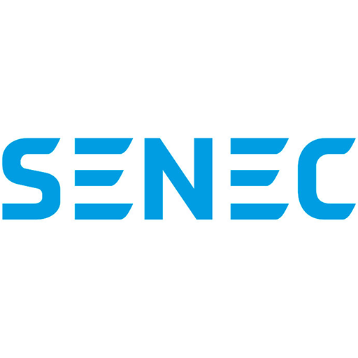

# ioBroker.senec

**Tests:** 

## senec adapter for ioBroker

[Dokumentation DE](docs/de/README.md) 
[Documentation EN](docs/en/README.md)

Initially targeted at the Senec Home V2.1 System.
In the Senec.Home system, only selected values can be changed by the adapter. Use of this functionality is at your own risk and must be activated manually in the configuration beforehand.
Senec currently also no longer provides a reliable way to influence peak shaving via the web interface. For this purpose, mein-senec.de must be used.
Whether other systems (e.g. V3) also work with it depends on whether they are also based on lala.cgi and provide the same JSON information.
Even with integration into the Senec.Clound it is not guaranteed that the data can still be retrieved via the web interface (for this please report your experiences).

Adapter supports local polling via lala.cgi and polling via Web API.

Systems that might work:
* Senec Home 4.0,  6.0, 8.0, 10.0 / Blei
* Senec Home 5.0, 7.5, 10.0, 15.0 / Lithium
* Senec Home V2 5.0, 7.5, 10.0
* Senec Home V2.1
* Senec.Home V3
* Senec.Home V4
* Senec Business 30.0 / Blei
* Senec Business V2 30.0 / Blei
* Senec Business 25.0 / Lithium
* Senec Business V2_2ph / Lithium
* Senec Business V2 3ph / Lithium
* ADS Tec
* OEM LG
* Solarinvert Storage 10.0 / Blei

SENEC Systems that don't provide a local webinterface might be monitored by using the API functionality only. Please contact the developer if you have any input on this.

## Disclaimer
**All product and company names or logos are trademarks™ or registered® trademarks of their respective holders. Use of them does not imply any affiliation with or endorsement by them or any associated subsidiaries! This personal project is maintained in spare time and has no business goal.**

## Usage
You can find a description of some sample states in documentation. All states of this adapter are read-only states unless they are control-states to control the appliance.
   
### Deprecated / Removed states
* STATISTIC
* Display
* _calc (not relevant anymore since we lost STATISTIC)
* BAT1OBJ[2-4] 

## Donate
Maintenance of this adapter can be quite time consuming. If you wish to thank the author, please use these links:

## Changelog

<!--
  Placeholder for the next version (at the beginning of the line):
  ### **WORK IN PROGRESS**
-->
### 2.9.3 (2026-07-17)
- Fix: jsonConfig staticText missing size attributes (E5507)

### 2.9.2 (2026-07-16)
- Fix: API energy flow discovery picked wrong Anlagen ID when stale states existed. Now prefers ID with Dashboard data.
- Fix: Web AllTime measurements now update every slow tier cycle (default 24h) instead of only once per year.
- Fix: Web poll loop could die silently if measurement polling threw an unhandled error.
- Fix: Numeric string precision loss in ValueTyping (e.g. DEVICE_ID). Added `stringtype` support.
- Dashboard: Grid quality card redesigned as table layout (Frequency, Total Power, per-phase Voltage/Power/Current). Support for EnFluRi 2 with automatic detection (non-zero voltage).
- Dashboard: Battery tab — module status counts (active/charging/discharging), cycles & lifetime energy table per pack, per-pack voltage and current.
- Dashboard: System tab — PV string details (MPP power/voltage/current), wallbox info (EV connected, smart charge, per-phase current), operating hours, installation date, installer contact.
- Dashboard: Energy flow — live autarky badge (API native or calculated), week + lifetime autarky in period totals. Battery capacity auto-detected from API or Web (config as fallback). Fixed flow paths to show actual source/destination (e.g. battery→grid instead of PV→grid when PV is idle). Power labels on all flow paths. Tab switch now re-renders with latest state values.
- Dashboard: Measurement charts — battery level (%) line overlay with comparison support and data table.
- Web: Poll battery state (`getaccustate.php`) on medium tier — voltage, current, capacity, type, history.
- Web: Secondary plant discovery and measurement polling. Control via `control.Plants.{id}.poll`.
- AdaptiveRequestQueue: Optional per-request retry with configurable max attempts and logging.
- Simplified `state_attr.js` from ~7000 to ~1080 lines (stripped redundant defaults, added type header comment).

### 2.9.1 (2026-07-16)
- Fix: jsonConfig validation error (`collapsed` not allowed on panel type)
- Fix: Welcome screen tile color changed from green to SENEC blue

### 2.9.0 (2026-07-15)
- Web dashboard: Built-in dashboard accessible at `http://<iobroker>:8082/senec/` via ioBroker.web extension. Shows on the ioBroker.web welcome page. Dark/light theme toggle. Internationalization with 11 languages.
- Energy flow diagram: Live SVG visualization of power flow between PV, battery, grid, house, and wallbox. Animated curved flow paths with power-proportional thickness. Battery SOC gauge with fill level indicator. Operating mode badge (color-coded). Battery time estimates (until empty/full). Multi-source support with manual override (Local > API > Web). Period totals (today/month/year) with self-sufficiency display. Last update timestamp from active connector.
- Measurement charts: Bar charts for hourly (today), daily (month), and monthly (year) energy data. Toggle individual measurement types. Stacked production/consumption view. Period comparison (yesterday, previous month, selectable year). Data source selector (Auto/API/Web). Auto-update mode. Data table view. PNG image export. Today view trims to hours with data.
- Battery health tab: System and per-pack SOH with color-coded health indicators. Module count. Separate temperature card (overall, per-module, per-module cell temps). Separate voltage card (overall min/max with delta, per-module cell voltages with delta). Data from Local (BMS) or API (SystemDetails) with source indicator badges.
- System tab: Grid quality (frequency, per-phase voltage/power/current, phase skew warning). Feature flags from all connectors with mismatch detection. System details (product, firmware, GUI/NPU version, inverter state, casing/MCU/battery/inverter temperatures). Source indicator badges on all metrics.
- Control panel: Force battery charging (toggle), appliance reboot (with confirmation), emergency power reserve, peak shaving (mode-dependent fields), SG-Ready (enable + thresholds), switchable sockets (per-socket mode with auto-threshold settings, name editing via web), wallbox control (smart charge, current, intercharge). All controls check connector availability and show warnings. Apply button feedback with "Sent" confirmation. Config changes auto-detected.
- Appliance log viewer: Browse SENEC device logs by date with filterable table (Time, Level, Category, Message). Supports Info/Warning/Error/Panic levels with color-coded row highlighting. Newest entries first. Live mode auto-refreshes today's log (UTC-aware). Download raw log files.
- Per-connector connection states: New `info.localConnected`, `info.apiConnected`, `info.webConnected`, `info.connectConnected` states. Local polling now writes `info.lastPoll.HighPrio` and `info.lastPoll.LowPrio` timestamps.
- Accessibility: Semantic HTML, ARIA roles and attributes, keyboard navigation for tabs, focus indicators, screen reader support.
- State translations: Added system state 100 (SOX calibration), system types 20-21 (SENEC.Home V3 hybrid LFP), updated wallbox states with official SENEC names, added SYS_UPDATE.FSM_STATE and PWR_UNIT.TYPE translations. Fixed BATTERY_IMPORT/EXPORT and accuimport/accuexport naming.
- Admin settings: Collapsible control overview panel showing available controls per connector. Simplified control help texts. Battery capacity config field for manual input.

### 2.8.4 (2026-07-13)
- Web measurements: Measurement history (today, yesterday, monthly, yearly, AllTime) and autarky can now be polled from mein-senec.de. Data appears under `_meinsenec.Measurements` and `_meinsenec.Autarky`. Enable in adapter settings with "Poll measurement history". Optional 5-minute detail data with time-based keys for today/yesterday (creates ~3,500 additional states).
- Web request queue: All mein-senec.de requests now use an AdaptiveRequestQueue for rate-limiting. Configurable concurrency and min request interval in adapter settings.
- API/Web request interval: Minimum time between requests is now configurable for both API and web connectors (API previously hardcoded at 400ms).
- User-Agent settings moved from SENEC App API tab to SENEC Account tab — now applies to all connectors.
- Queue diagnostics cleanup: Diagnostics states for both API and web queues are now automatically cleaned up when debug states are disabled.

### [Former Updates](CHANGELOG_OLD.md)

## License
MIT License

Copyright (c) 2020-2026 Norbert Bluemle <github@bluemle.org>

Permission is hereby granted, free of charge, to any person obtaining a copy
of this software and associated documentation files (the "Software"), to deal
in the Software without restriction, including without limitation the rights
to use, copy, modify, merge, publish, distribute, sublicense, and/or sell
copies of the Software, and to permit persons to whom the Software is
furnished to do so, subject to the following conditions:

The above copyright notice and this permission notice shall be included in all
copies or substantial portions of the Software.

THE SOFTWARE IS PROVIDED "AS IS", WITHOUT WARRANTY OF ANY KIND, EXPRESS OR
IMPLIED, INCLUDING BUT NOT LIMITED TO THE WARRANTIES OF MERCHANTABILITY,
FITNESS FOR A PARTICULAR PURPOSE AND NONINFRINGEMENT. IN NO EVENT SHALL THE
AUTHORS OR COPYRIGHT HOLDERS BE LIABLE FOR ANY CLAIM, DAMAGES OR OTHER
LIABILITY, WHETHER IN AN ACTION OF CONTRACT, TORT OR OTHERWISE, ARISING FROM,
OUT OF OR IN CONNECTION WITH THE SOFTWARE OR THE USE OR OTHER DEALINGS IN THE
SOFTWARE.
