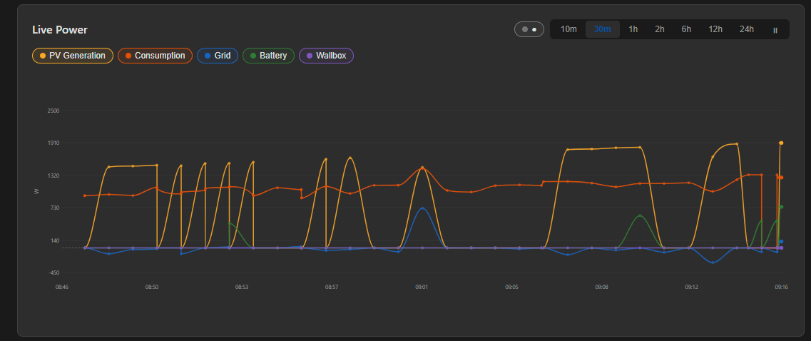

#  ioBroker.senec

**Tests:** 

## SENEC adapter for ioBroker

[Dokumentation DE](docs/de/README.md) | [Documentation EN](docs/en/README.md)

Your SENEC system knows a great deal about itself. This adapter brings all of it into ioBroker — down to individual cell voltages and per-phase grid quality — and comes with a dashboard you do not have to build.

That screenshot is not a vis project someone assembled. It ships with the adapter, needs no extra adapters or widgets, and is running as soon as the instance is. Dark and light theme, 11 languages, usable on a phone.

### Four Ways In

The appliance answers on your own network, and SENEC runs three cloud services. The adapter speaks all four, independently.

**The local connector needs nothing but an IP address.** No account, no credentials, no request ever leaving your network — that is where this adapter started and it still works that way on its own. The cloud connectors are there when you want the measurement history and portal features that only exist online, or when your appliance has no local interface to talk to.

| Connector | Data source | Update speed | Key capabilities |
|-----------|------------|-------------|-----------------|
| **[Local](docs/en/README.md#local-connection-lalacgi)** | lala.cgi (LAN) | 10s real-time | Full BMS data, grid meter, wallbox, appliance control |
| **[SENEC App API](docs/en/README.md#senec-app-api)** | Cloud API | 6 min | Dashboard, measurements, system details |
| **[mein-senec.de](docs/en/README.md#mein-senecde)** | Web portal | 6 min | Measurements, emergency power, peak shaving, SG-Ready, sockets |
| **[SENEC.Connect](docs/en/README.md#senecconnect)** | Azure API | 5 min | Battery & meter data |

Replaced your appliance? Both systems stay on your mein-senec.de account, and the adapter finds [all of them](docs/en/README.md#additional-systems-on-the-account) — so the old one's history stays reachable next to the new one's live data.

One is enough to get started. Combining them is where it gets interesting: the local connection gives ten-second resolution and the deepest detail, while the cloud services hold years of measurement history and features that exist nowhere else — emergency power reserve, peak shaving, SG-Ready, switchable sockets. And if one source is down, or your appliance has no local interface at all, the others carry on regardless.

### Built-in Dashboard

**[Overview](docs/en/README.md#overview-tab)** — Live energy flow diagram with animated power paths, battery SOC gauge, operating mode, period totals with autarky. Event timeline showing today's warnings and errors.

**[Live power curve](docs/en/README.md#overview-tab)** — Drag through history and pinch to zoom, from a five-minute window out to thirty days, on a desktop or a tablet. If you log the power states with InfluxDB, SQL or History, the chart backfills from them and you can pan back through everything you have recorded.

**[Battery](docs/en/README.md#battery-tab)** — State of health per pack, charge cycles, cell voltage heatmap (spot imbalance at a glance), temperatures.

**[Charts](docs/en/README.md#charts-tab)** — Measurement history (hourly/daily/monthly/yearly) with comparison mode, stacked view, battery level overlay, data table, PNG export.

**[System](docs/en/README.md#system-tab)** — Grid quality (frequency, per-phase voltage/power/current), PV string details, wallbox info, feature flags, firmware versions.

**[Control](docs/en/README.md#control-tab)** — Force charge, appliance reboot, emergency power reserve, peak shaving, SG-Ready, switchable sockets, wallbox control. Available via Local and/or mein-senec.de.

**[Logs](docs/en/README.md#logs-tab)** — Browse device logs by date, filter by level/category, live mode, download.

**[Statistics](docs/en/README.md#statistics-tab)** — Browse the weekly 5-minute exports mein-senec.de keeps, going back years. Filter by day, switch between hourly and 5-minute resolution, chart or table, and export what you select.

### [External Energy Sources](docs/en/README.md#external-sources)

Integrate third-party PV inverters, consumers (wallbox, heat pump, etc.), and batteries from other ioBroker adapters into the SENEC dashboard. Values can be mapped directly from states or calculated via formulas (e.g. `{voltage.state} * {current.state}`). External sources appear in the energy flow diagram and live power chart — either added to SENEC totals or shown as separate nodes.

### Built to Keep Running

An adapter polling a battery every ten seconds runs unattended for years, so most of the work is in the parts you never see.

**It validates the connection to your appliance.** Local polling is HTTPS, and the certificate chain is verified against the CA you upload or one the adapter fetches from the portal for you. Where no CA can be obtained, the adapter falls back to recording the appliance's certificate fingerprint on first contact and warning you whenever it changes — continuity monitoring rather than full verification, chosen so a legitimate certificate change never leaves you disconnected. [How it works](docs/en/README.md#tls-certificate-validation)

**It backs off instead of hammering.** Cloud requests run through a queue that watches success rates, widens the gap between requests when the server rate-limits or times out, and narrows it again once things recover.

**It recovers on its own.** A failed poll does not end polling. Connectors retry with growing delays and pick up where they left off, and `info.connectionStatus` tells you at a glance which sources are currently live.

**It can rebuild what it missed.** The App API connector can reconstruct lifetime measurement history from scratch, working backwards year by year in the background. [History rebuild](docs/en/README.md#history-rebuild)

### Supported Systems

Practically every SENEC storage system works: the Home range from the early lead-acid and lithium
models through V2, V2.1 and V3, the current V4 | P4 | E4 generation, the Business models, and the
partner variants ADS Tec, OEM LG and Solarinvert.

Systems with a local web interface can use all four connectors. Those without one — the V4
generation among them — work through the SENEC App API, mein-senec.de and SENEC.Connect. Which
data points appear varies by model.

See the [full list of models](docs/SUPPORTED_SYSTEMS.md) to find your system by name.

### Requirements

- ioBroker running on Node.js 22 or newer
- For the local connector: the SENEC appliance reachable on your network, and its IP address
- For the cloud connectors: a mein-senec.de account
- For the dashboard: the ioBroker.web adapter (most installations already have it)

### Quick Start

Configure **at least one** connector on a new instance — you do not need all four, and you can add the others later.

**Local, for real-time data.** Open the *[Local Connection](docs/en/README.md#local-connection-lalacgi)* tab and enter the appliance's IP address. That is the whole setup. This connector polls every 10 seconds and provides the most detail: full battery management data, per-phase grid values, wallbox information and appliance control.

**Cloud, if the appliance has no local web interface** (the V4 generation, for example) **or you would rather not poll it directly.** Enter your mein-senec.de credentials in the *[SENEC Account](docs/en/README.md#senec-account)* tab, then enable the *[SENEC App API](docs/en/README.md#senec-app-api)* or *[mein-senec.de](docs/en/README.md#mein-senecde)* connector. Both use the same credentials, and both support accounts with [two-factor authentication](docs/en/README.md#two-factor-authentication-2fa). Data arrives every few minutes rather than in real time.

Once an instance is running, the dashboard is at `http://<your-iobroker>:8082/senec/`. Running more than one system? Create an instance per system — each dashboard follows its own instance. States appear under `senec.0` — the [state reference](docs/en/README.md#state-reference) lists them all — and can be logged with any history adapter.

Beyond that: [every setting explained](docs/en/README.md#configuration), the [complete state reference](docs/en/README.md#state-reference), [control features](docs/en/README.md#appliance-control) and [troubleshooting](docs/en/README.md#troubleshooting).

### Reporting a Problem

For questions, setups and comparing notes with other users, there is a [dedicated thread in the ioBroker forum](https://forum.iobroker.net/topic/30620/neuer-adapter-senec-home-adapter) — mainly German, and usually the quickest way to an answer. For something that looks like a bug, please open an issue on [GitHub](https://github.com/nobl/ioBroker.senec/issues). It helps to include your system model, which connectors you have enabled, the adapter and ioBroker versions, and a debug-level log covering the failure — the documentation walks through [collecting one](docs/en/README.md#collecting-a-debug-log) and [what makes a report actionable](docs/en/README.md#reporting-an-issue).

One thing worth checking first: implausible readings usually originate in the appliance rather than in the adapter, which mostly passes values through. A value that looks wrong on the dashboard will generally look just as wrong in the appliance's own web interface — and if it does not, that difference is exactly what to put in the report.

## Disclaimer
**All product and company names or logos are trademarks™ or registered® trademarks of their respective holders. Use of them does not imply any affiliation with or endorsement by them or any associated subsidiaries! This personal project is maintained in spare time and has no business goal.**

**Control features are used at your own risk.** Force charge, appliance reboot, emergency power reserve, peak shaving, SG-Ready, socket switching and wallbox control each have to be enabled deliberately and acknowledged in the settings before they appear. The adapter sends what it is asked to send; it does not arbitrate between conflicting commands arriving from different connectors, nor does it judge whether a command is sensible for your system.

**Polling too aggressively can overload the appliance.** Shortening the local polling interval or adding extra high-priority data points can make the device restart, stop responding, or fail to synchronise with the SENEC cloud. If that happens, reduce the frequency or stop the adapter. The defaults are chosen to be safe.

**No warranty, and no liability.** This adapter is a spare-time project, provided as-is under the MIT license. It talks to an expensive appliance over interfaces SENEC neither documents nor supports, and it can send commands that change how that appliance behaves. Everything you do with it is your own responsibility. The author accepts no liability for damage to your system, lost or wrong data, missed feed-in, or any other consequence of using it — and cannot tell you whether using it affects your warranty or support arrangements with SENEC or your installer. If that is not acceptable to you, please do not use this adapter.

### Deprecated / Removed states
* STATISTIC
* Display
* _calc (not relevant anymore since we lost STATISTIC)
* BAT1OBJ[2-4] 

## Donate
Maintenance of this adapter can be quite time consuming. If you wish to thank the author, please use these links:

## Supporters
I am grateful to everyone who supports my work through GitHub Sponsors and in other ways. See [SUPPORTERS.md](SUPPORTERS.md) for acknowledgements.

## Changelog

<!--
  Placeholder for the next version (at the beginning of the line):
  ### **WORK IN PROGRESS**
-->
### **WORK IN PROGRESS**
- New: The timeout for ordinary SENEC API requests is configurable, and its default is raised from 10 to 30 seconds. The API is regularly slow enough that dashboard and system status requests were timing out, which loses the whole reading until the next poll cycle. Measurement history keeps its own, longer limit.
- Fix: An error reply from mein-senec.de was treated as if it were data. A failed request could write an error page into the status states, advance the "last poll" timestamp and leave the connector reporting itself as connected. Responses are now checked centrally, so a failure is a failure everywhere.
- Fix: The adapter no longer keeps its request rate up when mein-senec.de is struggling. A server error now pauses the whole queue briefly, exactly as rate limiting already did, and the server's own requested delay is honoured. Control commands are still never repeated automatically.
- Fix: If the SENEC login had to be renewed and that renewal failed, the adapter could end up with no token, no scheduled retry and no error — silently stuck until restarted. It now retries with a growing delay, so it recovers on its own.
- Fix: Measurements for "today" and "yesterday" could be fetched for the wrong day between midnight and the UTC changeover — up to two hours every night in Central European time, and any part of the night in other time zones.
- Fix: The battery level recorded from mein-senec.de lost a full day twice a year, at the daylight-saving changeovers, because two adjacent days were not recognised as adjacent.
- Fix: Sections the appliance did not list during discovery are no longer dropped from polling. A restricted or partial answer could previously reduce the adapter to polling almost nothing, including the live values.
- Fix: A failing poll step is now counted, so a system that is only partly readable is reported instead of passing as healthy.
- Fix: External energy sources sharing one foreign state now all update. Previously only the last one configured for a given state received changes, and a state used both directly and in a formula drove only one of the two. Values are also read once at startup instead of showing 0 until the source next changes, and a formula that divides by zero no longer writes Infinity.

### 2.13.1 (2026-08-01)
- Fix: A failed API read is now retried instead of being dropped until the next poll cycle. Retries apply to transient failures only — timeout, rate limiting, server error, dropped connection. Control commands are never retried, so none can reach the appliance twice.
- API: A poll tier that could not complete now says so in the log, along with the fact that it is picked up again on the next cycle. Previously only the failure was logged, which read as if the data were lost.
- Fix: Rate limiting by mein-senec.de went unnoticed. Its responses are read directly rather than raised as errors, so a "too many requests" reply counted as a success and the adapter kept its request rate up instead of easing off. It now backs off, honours the server's own retry delay, logs the event, and reports it under the connector's rate-limit diagnostics. Most noticeable when stepping through statistics weeks quickly. The same applies to a request repeated after a session expired, which previously skipped this handling altogether.
- Fix: Downloading a statistics week ran into the short timeout meant for the portal's small JSON replies. A week at 5-minute resolution now gets a timeout that fits it.
- Fix: A statistics week the server refused to send was displayed as an empty week rather than as an error.
- Fix: A dashboard label could briefly show its key name (`stats_title`) instead of its text. Translation dictionaries are now revalidated on every load, views wait for them before drawing, and a label whose key cannot be resolved keeps its English text instead of being overwritten with the key.

### 2.13.0 (2026-08-01)
- Fix: Scaling factors defined in the state definitions were never applied to any state that also carries a unit — which is every state that defines one — so 14 local states were reported unscaled. Most visibly `BMS.SYSTEM_SOH`, which read 1000 instead of 100.0 %. Other states involved:
  - `BMS.SYSTEM_SOC`, `BAT1OBJ1.BMS_SYSTEM_SOC` — were 10× too high (%)
  - `BMS.MAX_TEMP`, `BMS.MIN_TEMP`, `BAT1OBJ1.BMS_MAX_TEMP`, `BAT1OBJ1.BMS_MIN_TEMP`, `AMPACE.MODULE_MAX_TEMP`, `AMPACE.MODULE_MIN_TEMP`, `AMPACE.CELL_TEMPERATURES_MODULE_A`, `AMPACE.CELL_TEMPERATURES_MODULE_B` — were 10× too high (°C)
  - `BMS.MAX_CELL_VOLTAGE`, `BMS.MIN_CELL_VOLTAGE` — were 100× too high (V)
  - `FACTORY.DESIGN_CAPACITY` — was 1000× too high (kWh)

  These now report their true values. History recorded before this change keeps the old scale, so logged series will step at the moment of the update.
- Live chart: Canvas renderer replaces SVG — enables touch drag and pinch-to-zoom on tablets/mobile. Hover tooltips. requestAnimationFrame throttling for smooth interaction.
- Fix: External battery and consumer energy flow direction now reflects actual power sign (charge vs discharge, feed-in vs consumption).
- Admin UI: Clarified column headers in external sources table to indicate which fields apply to which source types.
- Fix: API and web connector polling now auto-recovers after transient failures (timeout, server error) instead of permanently stopping. Connection status indicators flip correctly on failure and recovery.
- Log proxy: Reuse pooled HTTPS connections to the device (keep-alive) instead of a new TLS handshake per request — noticeably lighter in log live mode. Connections are closed on TLS re-negotiation and on unload.
- SENEC.Connect: Failed requests now log the reason reported by the server instead of only the HTTP status code — in particular when the monthly request quota is exhausted.
- Admin UI: Clarified the SENEC.Connect polling interval help — explains why 60 seconds is the lowest quota-safe value, and that the request quota belongs to the subscription key, so running the same key in another system requires a longer interval.
- Live chart: History backfill now resolves the recording adapter per state instead of deriving one adapter from a single probe state. States may be recorded by different history adapters, and a state that is not recorded (or whose query fails) only costs its own line — previously it could silently disable backfill for the whole chart.
- Live chart: New ⓘ panel lists the states behind each line and whether a history adapter records them, so a line without past data can be traced to the state that is missing. Reopening the panel re-checks, so enabling logging on a state takes effect without reloading the page.
- Fix: Live chart no longer queries the history adapter every 200 ms without end. Whenever the selected time window reached further back than the recorded data (a fresh install, a newly enabled history adapter, or any window longer than the available history), the "load older data" check re-armed itself indefinitely for as long as the dashboard was open. Delta loading now tracks the range already requested instead of the oldest data received.
- Live chart: The loading indicator and the buffer statistics line are now translated instead of English-only.
- Fix: The TLS certificate upload error message showed a literal placeholder instead of the actual error in French, Italian, Dutch, Polish, Russian, Ukrainian and Chinese.
- Charts: Battery level overlay now also works with the mein-senec.de connector, not only the App API. The portal offers no charge-level history, so the adapter samples the live value into hourly averages for the day view; the daily figures behind the month view are the portal's own daily average. Hourly values only exist for the time the adapter was running, and cannot be filled in afterwards.
- Live chart: Optional battery level line, off by default. It uses its own right-hand 0–100 % axis so it can share the chart with the power curves, and it is backfilled from a history adapter like every other line.
- Dashboard: New Statistics tab. mein-senec.de offers a weekly CSV export at 5-minute resolution reaching back years — far more than belongs in ioBroker states, so nothing is stored: the adapter keeps only the index of available weeks (refreshed daily) and fetches a single week on request. Pick a plant and week, filter to one day, switch between hourly means and 5-minute rows, show or hide columns, sort by any column, read min/mean/max of what is shown, switch between table and chart, and download the filtered result as CSV. Previous appliances on the same account are listed too, so their history is reachable as well.
- Fix: Measurement queries against the SENEC App API used the same 10 second timeout as the small dashboard calls, so the heavy year and month aggregations — which the server computes on request — could time out and lose a whole poll cycle. They now get their own timeout, configurable in the API settings and defaulting to 60 seconds.
- Documentation: Reworked readme and documentation. Two-factor authentication, collecting a debug log and reporting an issue are now explained, and so is polling additional systems on the same mein-senec.de account — a feature that had states and a control switch but no documentation at all. The supported system list moved to its own file and now uses the appliance's own naming. Issue reports go through a form asking for the model, connectors and log, and questions are pointed at the adapter thread in the ioBroker forum.
- Special thanks to everyone supporting this project — see [SUPPORTERS.md](SUPPORTERS.md).

### 2.12.0 (2026-07-23)
- Live chart: Drag to pan through history, scroll to zoom (5min–30 days). Lazy-loads history data on demand as you pan. Per-line downsampling preserves all metrics at any zoom level. Midnight date markers. View clamped to available data with progressive loading. Loading indicator and buffer stats.
- Security: Multi-layer TLS certificate validation for local SENEC connections — user-uploaded CA, cached CA (auto-downloaded from mein-senec.de), TOFU fingerprint pinning. Dashboard upload for CA certificate (.pem/.zip). TLS state values stored encrypted. Eliminates blind certificate bypass.
- Security: Fix polynomial ReDoS in formula regex, escape DOM-sourced values in log viewer, remove no-op string replace in charts.
- Dashboard: Multi-instance namespace support.

### 2.11.4 (2026-07-22)
- Fix: jsonConfig validation error (`collapsed` not allowed on panel type).
- Removed unused `info.extension` state.

### 2.11.3 (2026-07-22)
- Fix: Web extension log proxy crash (ERR_HTTP_HEADERS_SENT / ERR_STREAM_WRITE_AFTER_END) when SENEC device drops connection or browser disconnects mid-request. Abort orphaned upstream requests on client disconnect.
- Fix: Local connection failure no longer crashes adapter startup — other connectors (API, Web, Connect) continue normally. All connectors retry with exponential backoff on init failure.
- Local polling no longer gives up after max retries — backoff plateaus and polling continues indefinitely. Connection status updates on failure and recovery.
- New `info.connectionStatus` state (all/partial/none) for per-connector connection tracking.
- Dashboard: Debounce rendering via requestAnimationFrame — prevents browser freezes from rapid state update bursts.
- Dashboard: Rate limit log proxy (1 req/s), XHR timeouts, abort in-flight requests, prevent history load stacking.

### [Former Updates](CHANGELOG_OLD.md)

## License
MIT License

Copyright (c) 2020-2026 Norbert Bluemle <github@bluemle.org>

Permission is hereby granted, free of charge, to any person obtaining a copy
of this software and associated documentation files (the "Software"), to deal
in the Software without restriction, including without limitation the rights
to use, copy, modify, merge, publish, distribute, sublicense, and/or sell
copies of the Software, and to permit persons to whom the Software is
furnished to do so, subject to the following conditions:

The above copyright notice and this permission notice shall be included in all
copies or substantial portions of the Software.

THE SOFTWARE IS PROVIDED "AS IS", WITHOUT WARRANTY OF ANY KIND, EXPRESS OR
IMPLIED, INCLUDING BUT NOT LIMITED TO THE WARRANTIES OF MERCHANTABILITY,
FITNESS FOR A PARTICULAR PURPOSE AND NONINFRINGEMENT. IN NO EVENT SHALL THE
AUTHORS OR COPYRIGHT HOLDERS BE LIABLE FOR ANY CLAIM, DAMAGES OR OTHER
LIABILITY, WHETHER IN AN ACTION OF CONTRACT, TORT OR OTHERWISE, ARISING FROM,
OUT OF OR IN CONNECTION WITH THE SOFTWARE OR THE USE OR OTHER DEALINGS IN THE
SOFTWARE.
