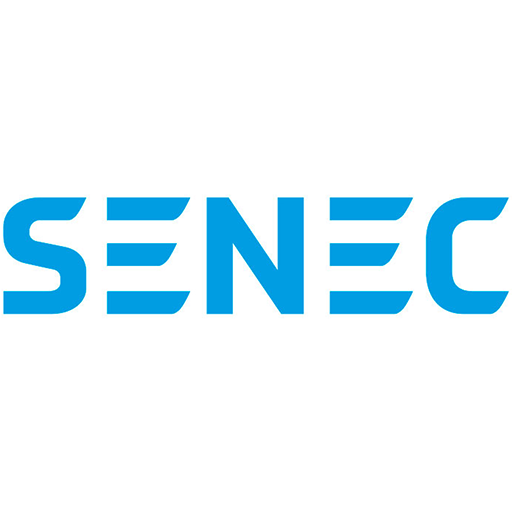

# ioBroker.senec

**Tests:** 

## SENEC adapter for ioBroker

[Dokumentation DE](docs/de/README.md) | [Documentation EN](docs/en/README.md)

Monitor and control your SENEC home battery storage system from ioBroker. The adapter connects via four independent data sources — use one or combine them for maximum coverage:

| Connector | Data source | Update speed | Key capabilities |
|-----------|------------|-------------|-----------------|
| **Local** | lala.cgi (LAN) | 10s real-time | Full BMS data, grid meter, wallbox, appliance control |
| **SENEC App API** | Cloud API | 6 min | Dashboard, measurements, system details |
| **mein-senec.de** | Web portal | 6 min | Measurements, emergency power, peak shaving, SG-Ready, sockets |
| **SENEC.Connect** | Azure API | 5 min | Battery & meter data |

### Built-in Dashboard

Access a full-featured dashboard at `http://<iobroker>:8082/senec/` — no extra adapters needed. Dark/light theme, 11 languages.

**Overview** — Live energy flow diagram with animated power paths, battery SOC gauge, operating mode, period totals with autarky. Live power curve chart with history backfill from InfluxDB/SQL/History. Event timeline showing today's warnings and errors.

**Battery** — State of health per pack, charge cycles, cell voltage heatmap (spot imbalance at a glance), temperatures.

**Charts** — Measurement history (hourly/daily/monthly/yearly) with comparison mode, stacked view, battery level overlay, data table, PNG export.

**System** — Grid quality (frequency, per-phase voltage/power/current), PV string details, wallbox info, feature flags, firmware versions.

**Control** — Force charge, appliance reboot, emergency power reserve, peak shaving, SG-Ready, switchable sockets, wallbox control. Available via Local and/or mein-senec.de.

**Logs** — Browse device logs by date, filter by level/category, live mode, download.

### External Energy Sources

Integrate third-party PV inverters, consumers (wallbox, heat pump, etc.), and batteries from other ioBroker adapters into the SENEC dashboard. Values can be mapped directly from states or calculated via formulas (e.g. `{voltage.state} * {current.state}`). External sources appear in the energy flow diagram and live power chart — either added to SENEC totals or shown as separate nodes.

### Supported Systems

* Senec Home 4.0, 6.0, 8.0, 10.0 / Blei
* Senec Home 5.0, 7.5, 10.0, 15.0 / Lithium
* Senec Home V2 5.0, 7.5, 10.0
* Senec Home V2.1
* Senec.Home V3
* Senec.Home V4
* Senec Business 30.0 / Blei
* Senec Business V2 30.0 / Blei
* Senec Business 25.0 / Lithium
* Senec Business V2_2ph / Lithium
* Senec Business V2 3ph / Lithium
* ADS Tec
* OEM LG
* Solarinvert Storage 10.0 / Blei

Systems without a local web interface can be monitored using the API and/or Web connectors. Please contact the developer if you have input on additional system compatibility.

### Getting Started

See the [full documentation](docs/en/README.md) for installation, configuration, and feature details.

## Disclaimer
**All product and company names or logos are trademarks™ or registered® trademarks of their respective holders. Use of them does not imply any affiliation with or endorsement by them or any associated subsidiaries! This personal project is maintained in spare time and has no business goal.**

### Deprecated / Removed states
* STATISTIC
* Display
* _calc (not relevant anymore since we lost STATISTIC)
* BAT1OBJ[2-4] 

## Donate
Maintenance of this adapter can be quite time consuming. If you wish to thank the author, please use these links:

## Supporters
I am grateful to everyone who supports my work through GitHub Sponsors and in other ways. See [SUPPORTERS.md](SUPPORTERS.md) for acknowledgements.

## Changelog

<!--
  Placeholder for the next version (at the beginning of the line):
  ### **WORK IN PROGRESS**
-->
### **WORK IN PROGRESS**
- Live chart: Canvas renderer replaces SVG — enables touch drag and pinch-to-zoom on tablets/mobile. Hover tooltips. requestAnimationFrame throttling for smooth interaction.
- Fix: External battery and consumer energy flow direction now reflects actual power sign (charge vs discharge, feed-in vs consumption).
- Admin UI: Clarified column headers in external sources table to indicate which fields apply to which source types.
- Fix: API and web connector polling now auto-recovers after transient failures (timeout, server error) instead of permanently stopping. Connection status indicators flip correctly on failure and recovery.
- Log proxy: Reuse pooled HTTPS connections to the device (keep-alive) instead of a new TLS handshake per request — noticeably lighter in log live mode. Connections are closed on TLS re-negotiation and on unload.
- SENEC.Connect: Failed requests now log the reason reported by the server instead of only the HTTP status code — in particular when the monthly request quota is exhausted.
- Admin UI: Clarified the SENEC.Connect polling interval help — explains why 60 seconds is the lowest quota-safe value, and that the request quota belongs to the subscription key, so running the same key in another system requires a longer interval.
- Live chart: History backfill now resolves the recording adapter per state instead of deriving one adapter from a single probe state. States may be recorded by different history adapters, and a state that is not recorded (or whose query fails) only costs its own line — previously it could silently disable backfill for the whole chart.
- Live chart: New ⓘ panel lists the states behind each line and whether a history adapter records them, so a line without past data can be traced to the state that is missing. Reopening the panel re-checks, so enabling logging on a state takes effect without reloading the page.
- Fix: Live chart no longer queries the history adapter every 200 ms without end. Whenever the selected time window reached further back than the recorded data (a fresh install, a newly enabled history adapter, or any window longer than the available history), the "load older data" check re-armed itself indefinitely for as long as the dashboard was open. Delta loading now tracks the range already requested instead of the oldest data received.
- Live chart: The loading indicator and the buffer statistics line are now translated instead of English-only.
- Fix: The TLS certificate upload error message showed a literal placeholder instead of the actual error in French, Italian, Dutch, Polish, Russian, Ukrainian and Chinese.
- Fix: Scaling factors defined in the state definitions were never applied to any state that also carries a unit, which is every state that defines one. 14 local states were therefore reported unscaled — `BMS.SYSTEM_SOH` as 1000 instead of 100.0 %, cell and module temperatures ten times too high, cell voltages a hundred times too high, `FACTORY.DESIGN_CAPACITY` a thousand times too high. Those states now report their true values; existing history for them keeps the old scale.
- Charts: Battery level overlay now also works with the mein-senec.de connector, not only the App API. The portal offers no charge-level history, so the adapter samples the live value into hourly averages for the day view; the daily figures behind the month view are the portal's own daily average. Hourly values only exist for the time the adapter was running, and cannot be filled in afterwards.
- Special thanks to everyone supporting this project — see [SUPPORTERS.md](SUPPORTERS.md).

### 2.12.0 (2026-07-23)
- Live chart: Drag to pan through history, scroll to zoom (5min–30 days). Lazy-loads history data on demand as you pan. Per-line downsampling preserves all metrics at any zoom level. Midnight date markers. View clamped to available data with progressive loading. Loading indicator and buffer stats.
- Security: Multi-layer TLS certificate validation for local SENEC connections — user-uploaded CA, cached CA (auto-downloaded from mein-senec.de), TOFU fingerprint pinning. Dashboard upload for CA certificate (.pem/.zip). TLS state values stored encrypted. Eliminates blind certificate bypass.
- Security: Fix polynomial ReDoS in formula regex, escape DOM-sourced values in log viewer, remove no-op string replace in charts.
- Dashboard: Multi-instance namespace support.

### 2.11.4 (2026-07-22)
- Fix: jsonConfig validation error (`collapsed` not allowed on panel type).
- Removed unused `info.extension` state.

### 2.11.3 (2026-07-22)
- Fix: Web extension log proxy crash (ERR_HTTP_HEADERS_SENT / ERR_STREAM_WRITE_AFTER_END) when SENEC device drops connection or browser disconnects mid-request. Abort orphaned upstream requests on client disconnect.
- Fix: Local connection failure no longer crashes adapter startup — other connectors (API, Web, Connect) continue normally. All connectors retry with exponential backoff on init failure.
- Local polling no longer gives up after max retries — backoff plateaus and polling continues indefinitely. Connection status updates on failure and recovery.
- New `info.connectionStatus` state (all/partial/none) for per-connector connection tracking.
- Dashboard: Debounce rendering via requestAnimationFrame — prevents browser freezes from rapid state update bursts.
- Dashboard: Rate limit log proxy (1 req/s), XHR timeouts, abort in-flight requests, prevent history load stacking.

### 2.11.2 (2026-07-21)
- Live chart: Linear interpolation for sparse history data instead of flat carry-forward. Smoother lines when SQL logs on change only.
- Live chart: Skip history queries for states without a history adapter enabled (no more SQL warnings).

### 2.11.1 (2026-07-21)
- Live chart: Delta history loading — expanding the time window only fetches the missing range instead of reloading all data.

### [Former Updates](CHANGELOG_OLD.md)

## License
MIT License

Copyright (c) 2020-2026 Norbert Bluemle <github@bluemle.org>

Permission is hereby granted, free of charge, to any person obtaining a copy
of this software and associated documentation files (the "Software"), to deal
in the Software without restriction, including without limitation the rights
to use, copy, modify, merge, publish, distribute, sublicense, and/or sell
copies of the Software, and to permit persons to whom the Software is
furnished to do so, subject to the following conditions:

The above copyright notice and this permission notice shall be included in all
copies or substantial portions of the Software.

THE SOFTWARE IS PROVIDED "AS IS", WITHOUT WARRANTY OF ANY KIND, EXPRESS OR
IMPLIED, INCLUDING BUT NOT LIMITED TO THE WARRANTIES OF MERCHANTABILITY,
FITNESS FOR A PARTICULAR PURPOSE AND NONINFRINGEMENT. IN NO EVENT SHALL THE
AUTHORS OR COPYRIGHT HOLDERS BE LIABLE FOR ANY CLAIM, DAMAGES OR OTHER
LIABILITY, WHETHER IN AN ACTION OF CONTRACT, TORT OR OTHERWISE, ARISING FROM,
OUT OF OR IN CONNECTION WITH THE SOFTWARE OR THE USE OR OTHER DEALINGS IN THE
SOFTWARE.
