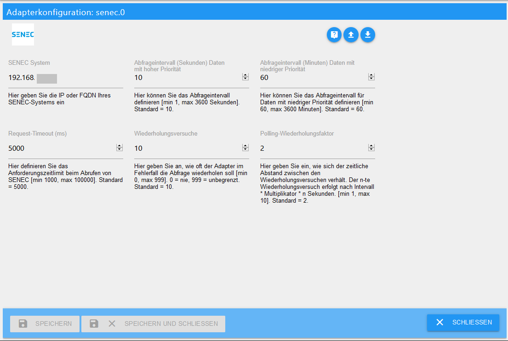

# ioBroker.senec

## SENEC Adapter für ioBroker
Der Adapter wurde für Senec Home V2.1 Systeme entwickelt.
Im Senec.Home System können keine Werte verändert werden. Auf die Einbindung der Sicherheitsladung wurde bewusst verzichtet.
Senec stellt derzeit über die Webschnittstelle auch keine zuverlässige Möglichkeit mehr zur Verfügung, das Peak Shaving zu beeinflussen. Hierzu muss mein-senec.de bemüht werden.
Ob andere Systeme (z.B. V3) ebenfalls damit funktionieren, ist davon abhängig, ob diese ebenfalls auf lala.cgi basieren und die gleichen JSON Informationen zur Verfügung stellen.
Auch bei Einbindung in die Senec.Clound ist nicht gewährleistet, dass die Daten weiterhin über die Webschnittstelle abgerufen werden können (hierzu bitte Erfahrungsberichte).

### SENEC.Home
Es handelt sich um ein System, dessen Herzstück ein Lithium-Ionen-Akku ist, der Strom speichert und wieder abgibt, der von der Solaranlage auf dem Dach erzeugt wird. Das funktioniert genau wie beim Akku im Smartphone, Notebook oder dem Akkuschrauber. Es steckt im Prinzip auch die gleiche bewährte Technologie drin. Wenn du mehr Strom auf dem Dach erzeugst, als du selbst im Haus verbrauchen kannst, fließt der Strom nicht ins Netz, sondern in deinen Speicher. Du kannst ihn dann nutzen, wenn es dunkel wird oder Wolken aufziehen und du weniger oder keinen Strom mehr erzeugst. Dann kannst du auch abends mit deinem eigenen Solarstrom den Fernseher betreiben oder das Essen kochen. 

## Voraussetzungen vor der Installation
Voraussetzungen für den Betrieb eines Senec.Home Speichersystems mit ioBroker, ist die erfolgreiche Einrichtung des Systems durch einen Elektriker. Ebenfalls muss sich das System im gleichen Netzwerk wie der ioBroker befinden.

### Installation
Eine Instanz des Adapters wird über die ioBroker Admin-Oberfläche installiert. 
Nach Abschluss der Installation einer Adapterinstanz öffnet sich automatisch ein Konfigurationsfenster.

## Konfiguration

### Fenster "Haupteinstellungen"

| Feld         | Beschreibung |                                                                       
|:-------------|:-------------|
|IP-Adresse    |Hier soll die IP-Adresse des gewünschten Senec.Home Systems angegeben werden.|
|Abfrageintervall|Hier kann ein alternativer Wert in Millisekunden gesetzt werden. In diesem Intervall werden die States Senec.Home Systems aktualisiert.|

Nach Abschluss der Konfiguration wird der Konfigurationsdialog mit `SPEICHERN UND SCHLIEßEN` verlassen. 
Dadurch efolgt im Anschluß ein Neustart des Adapters.

## Instanzen
Die Installation des Adapters hat im Bereich `Objekte` eine aktive Instanz des sonnen Adapters angelegt.

Auf einem ioBroker Server können mehrere Senec Adapter Instanzen angelegt werden. Umgekehrt kann ein Senec.Home System auch mit mehreren ioBroker Servern betrieben werden. Sollen mehrere Geräte von einem ioBroker Server gesteuert werden, sollte je System eine Instanz angelegt werden.
  
Ob der Adapter aktiviert und mit dem System verbunden ist, wird mit der Farbe des Status-Feldes der Instanz verdeutlicht. Zeigt der Mauszeiger auf das Symbol, werden weitere Detailinformationen dargestellt. 

## Objekte des Adapters
Im Bereich `Objekte` werden in einer Baumstruktur alle vom Adapter im Hub erkannten Geräte und Aktivitäten aufgelistet.

Nachfolgend werden die Objekte in States unterteilt.
Jeder Datenpunkt ist mit seinem zugehörigen Datentyp sowie seinen Berechtigungen aufgeführt. 
Berechtigungen können dezeit nur lesend (R) sein. Jeder Datenpunkt kann mindestens gelesen (R) werden.
Zur Suche nach einem bestimmten Datenpunkt empfiehlt sich die Suche mittels der Tastenkombination "STRG + F".

### States

#### Channel: info

* info.connection

    |Data type|Permission|                                                                       
    |:---:|:---:|
    |boolean|R|

   *Nur lesbarer boolscher Wert, welcher true ist, wenn die Verbindung zwischen ioBroker und Senec.Home hergestellt ist.*
   
#### Channel: BMS
   
* MODULES_CONFIGURED

    |Data type|Permission|                                                                       
    |:---:|:---:|
    |number|R|

   *Nur lesbare Zahl, die angibt, wieviele Module im System konfiguriert sind.*
   
* MODULE_COUNT

    |Data type|Permission|                                                                       
    |:---:|:---:|
    |number|R|

   *Nur lesbare Zahl, die angibt, wieviele Module im System angeschlossen sind (inkl. nicht konfigurierter).*
   

#### Channel: ENERGY
   
* GUI_BAT_DATA_FUEL_CHARGE

    |Data type|Permission|                                                                       
    |:---:|:---:|
    |number|R|

   *Nur lesbare Zahl, die den Füllstand in % des Systems angibt.*
   
* GUI_BAT_DATA_POWER

    |Data type|Permission|                                                                       
    |:---:|:---:|
    |number|R|

   *Nur lesbare Zahl, die angibt, wieviel Watt gerade in die Batterie eingespeist werden oder aus ihr entnommen (negativer Wert) werden.*
   
* GUI_BOOSTING_INFO

    |Data type|Permission|                                                                       
    |:---:|:---:|
    |boolean|R|

   *Nur lesbarer boolscher Wert, dessen Sinn bisher nicht eindeutig klar ist.*
   
* GUI_CHARGING_INFO

    |Data type|Permission|                                                                       
    |:---:|:---:|
    |boolean|R|

   *Nur lesbarer boolscher Wert, der angibt, ob die Batterie gerade geladen wird.*
   
* GUI_GRID_POW

    |Data type|Permission|                                                                       
    |:---:|:---:|
    |number|R|

   *Nur lesbare Zahl, die angibt, wieviel Watt gerade aus dem Netz gezogen oder ins Netz eingespeist (negativer Wert) werden.*
   
* GUI_HOUSE_POW

    |Data type|Permission|                                                                       
    |:---:|:---:|
    |number|R|

   *Nur lesbare Zahl, die angibt, wieviel Watt gerade vom Haus verbraucht werden.*
   
* GUI_INVERTER_POWER

    |Data type|Permission|                                                                       
    |:---:|:---:|
    |number|R|

   *Nur lesbare Zahl, die angibt, wieviel Watt vom PV System gerade erzeugt werden.*
   
* STAT_MAINT_REQUIRED

    |Data type|Permission|                                                                       
    |:---:|:---:|
    |boolean|R|

   *Nur lesbarer boolscher Wert, der angibt, ob das System gewartet werden muss.*
   
* STAT_STATE

    |Data type|Permission|                                                                       
    |:---:|:---:|
    |number|R|

   *Nur lesbare Zahl, die den Zustand des Systems repräsentiert.*
   
* STAT_STATE_Text

    |Data type|Permission|                                                                       
    |:---:|:---:|
    |string|R|

   *Nur lesbare Zeichenkette, die den Zustand des Systems in Klartext angibt. Leider liegen uns nur die original Senec-Texte in Deutsch vor.*
   
#### Channel: STATISTIC

* STAT_DAY_BAT_CHARGE

    |Data type|Permission|                                                                       
    |:---:|:---:|
    |number|R|

   *Nur lesbare Zahl, die angibt, wieviele kWh heute in der Batterie gespeichert wurden.*
   
* STAT_DAY_BAT_DISCHARGE

    |Data type|Permission|                                                                       
    |:---:|:---:|
    |number|R|

   *Nur lesbare Zahl, die angibt, wieviele kWh heute aus der Batterie entnommen wurden.*
   
* STAT_DAY_E_GRID_EXPORT

    |Data type|Permission|                                                                       
    |:---:|:---:|
    |number|R|

   *Nur lesbare Zahl, die angibt, wieviele kWh heute ins Netz eingespeist wurden.*
   
* STAT_DAY_E_GRID_IMPORT

    |Data type|Permission|                                                                       
    |:---:|:---:|
    |number|R|

   *Nur lesbare Zahl, die angibt, wieviele kWh heute aus dem Netz bezogen wurden.*
   
* STAT_DAY_E_HOUSE

    |Data type|Permission|                                                                       
    |:---:|:---:|
    |number|R|

   *Nur lesbare Zahl, die den heutigen Hausverbrauch in kWh angibt.*
   
* STAT_DAY_E_PV

    |Data type|Permission|                                                                       
    |:---:|:---:|
    |number|R|

   *Nur lesbare Zahl, die angibt, wieviele kWh heute von der PV Anlage produziert wurden.*
   
   
#### Channel: SYS_UPDATE

* UPDATE_AVAILABLE

    |Data type|Permission|                                                                       
    |:---:|:---:|
    |boolean|R|

   *Nur lesbarer boolscher Wert, der angibt, ob ein Update vorhanden ist (diese werden allerdings von Senec zur Verfügung gestellt und auch automatisiert eingespielt).*
   
   
#### Channel: WIZARD

* CONFIG_LOADED

    |Data type|Permission|                                                                       
    |:---:|:---:|
    |boolean|R|

   *Nur lesbarer boolscher Wert, der angibt, ob die Konfiguration geladen wurde (dieser Wert sollte nicht dauerhaft auf falsch stehen).*
   
* SETUP_NUMBER_WALLBOXES

    |Data type|Permission|                                                                       
    |:---:|:---:|
    |number|R|

   *Nur lesbare Zahl, die angibt, wieviele Wallboxen im System konfiguriert sind.*
   
* SETUP_WALLBOX_SERIAL[0..3]

    |Data type|Permission|                                                                       
    |:---:|:---:|
    |number|R|

   *Nur lesbare Zahl, die die Seriennummern der Wallboxen 0-3 angibt. Dieser Status ist nur verfügbar, falls Wallboxen im System konfiguriert sind.*