# ioBroker.senec

## SENEC Adapter für ioBroker

Überwachen und steuern Sie Ihr SENEC Heimspeichersystem. Der Adapter unterstützt vier unabhängige Konnektoren, die einzeln oder kombiniert genutzt werden können:

- **Lokal** (lala.cgi) — Direkte LAN-Abfrage mit 10-Sekunden-Echtzeitdaten. Liefert vollständige BMS-Daten, Netzzähler, Wallbox-Daten und Gerätesteuerung.
- **SENEC App API** — Cloud-basierte Abfrage über die SENEC App API. Dashboard-Daten, Messverlauf, Systemdetails und Wallbox-Informationen.
- **mein-senec.de** — Web-Portal-Abfrage. Statusübersicht, Messverlauf, Autarkie, Notstrom, Peak Shaving, SG-Ready und Steuerung schaltbarer Steckdosen.
- **SENEC.Connect** — Azure-basierte API. Batterie- und Zählerdaten über Subscription-Key.

Es müssen nicht alle Konnektoren aktiviert werden. Wählen Sie je nach Bedarf — rein lokale Setups funktionieren ebenso wie reine Cloud-Konfigurationen für Systeme ohne lokales Webinterface.

### Unterstützte Systeme

Systeme, die auf der lala.cgi-Schnittstelle basieren, sollten mit dem lokalen Konnektor funktionieren. Alle Systeme mit einem mein-senec.de-Konto können die API- und Web-Konnektoren nutzen. Die verfügbaren Datenpunkte können je nach Systemmodell variieren.

* Senec Home 4.0, 6.0, 8.0, 10.0 / Blei
* Senec Home 5.0, 7.5, 10.0, 15.0 / Lithium
* Senec Home V2 5.0, 7.5, 10.0
* Senec Home V2.1
* Senec.Home V3
* Senec.Home V4
* Senec Business 30.0 / Blei
* Senec Business V2 30.0 / Blei
* Senec Business 25.0 / Lithium
* Senec Business V2_2ph / Lithium
* Senec Business V2 3ph / Lithium
* ADS Tec
* OEM LG
* Solarinvert Storage 10.0 / Blei

Systeme ohne lokales Webinterface können möglicherweise über die API- und/oder Web-Konnektoren überwacht werden. Rückmeldungen zur Kompatibilität weiterer Systeme sind gerne gesehen.

## Haftungsausschluss
**Alle Produkt- und Firmennamen oder -logos sind Warenzeichen™ oder eingetragene® Warenzeichen der jeweiligen Inhaber. Ihre Verwendung impliziert keine Zugehörigkeit oder Befürwortung durch diese oder zugehörige Tochtergesellschaften! Dieses persönliche Projekt wird in der Freizeit gepflegt und hat kein geschäftliches Ziel.**

## Voraussetzungen

- ioBroker mit Node.js >= 22
- SENEC Speichersystem im lokalen Netzwerk (für lokalen Konnektor)
- mein-senec.de Konto (für API- und Web-Konnektor)
- ioBroker.web Adapter installiert (für das integrierte Dashboard)

## Installation

Installieren Sie den Adapter über das ioBroker Adapter-Repository. Nach der Installation erstellen Sie eine Adapter-Instanz und konfigurieren mindestens einen Konnektor.

## Konfiguration

Die Adaptereinstellungen sind in Tabs organisiert — je einer pro Konnektor sowie allgemeine Einstellungen und Debug-Optionen.

### SENEC Konto

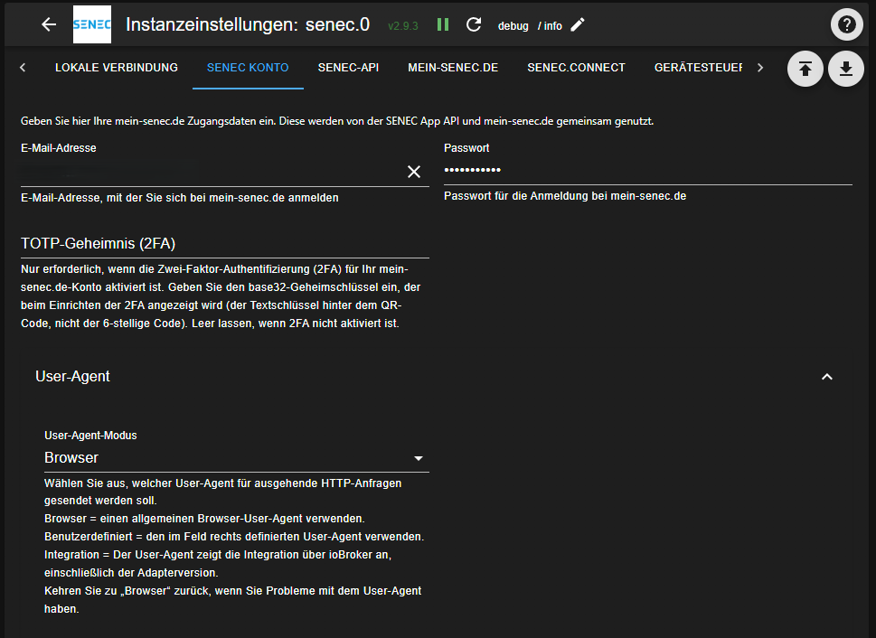

Geben Sie hier Ihre mein-senec.de Zugangsdaten ein. Diese werden von der SENEC App API und mein-senec.de gemeinsam genutzt. Hier lässt sich auch der User-Agent-Modus für ausgehende HTTP-Anfragen konfigurieren.

### Lokale Verbindung (lala.cgi)

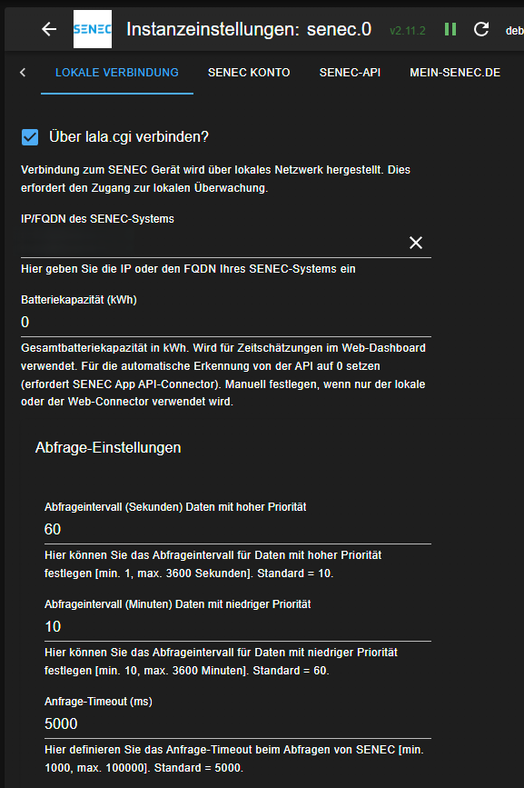

| Einstellung | Beschreibung | Standard |
|-------------|-------------|----------|
| Über lala.cgi verbinden | Lokale Abfrage aktivieren | Ein |
| SENEC System IP | IP-Adresse oder FQDN des SENEC Geräts | — |
| HTTPS verwenden | Aktivieren wenn das Gerät HTTPS nutzt | Aus |
| Abfrageintervall (hohe Priorität) | Intervall für Echtzeitdaten (Sekunden) | 10 |
| Abfrageintervall (niedrige Priorität) | Intervall für selten geänderte Daten (Minuten) | 60 |
| Request-Timeout | Zeitlimit für HTTP-Anfragen (ms) | 5000 |
| Wiederholungsversuche | Anzahl der Wiederholungen bei Fehlern | 10 |
| Wiederholungsfaktor | Backoff-Faktor zwischen Wiederholungen | 2 |

**Wichtig**: Zu häufige Abfragen oder zu viele Datenpunkte können das SENEC Gerät überlasten. Dies kann zu Neustarts, Nicht-Erreichbarkeit oder fehlender Cloud-Synchronisation führen. Bei Problemen die Abfragefrequenz reduzieren oder den Adapter stoppen.

#### Zusätzliche HighPrio-Polling-Datenpunkte

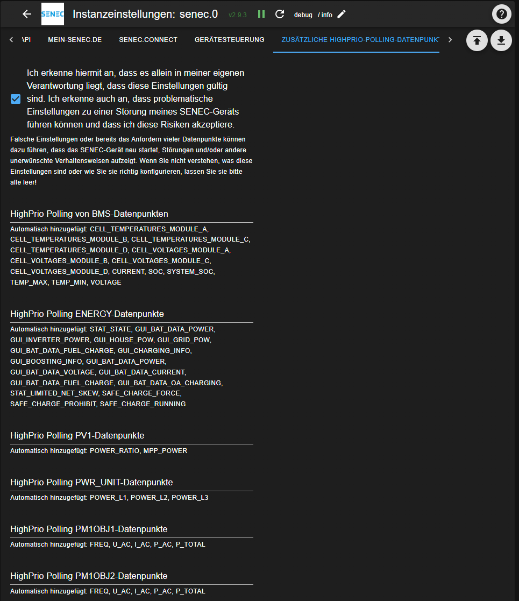

Sie können zusätzliche Datenbereiche (z.B. BMS, PV1, WALLBOX) zum hochprioritären Polling hinzufügen. Dies erfordert die Bestätigung eines Haftungsausschlusses. Es sind nur Zeichen A-Z, Ziffern 0-9 und Kommas erlaubt.

### SENEC App API

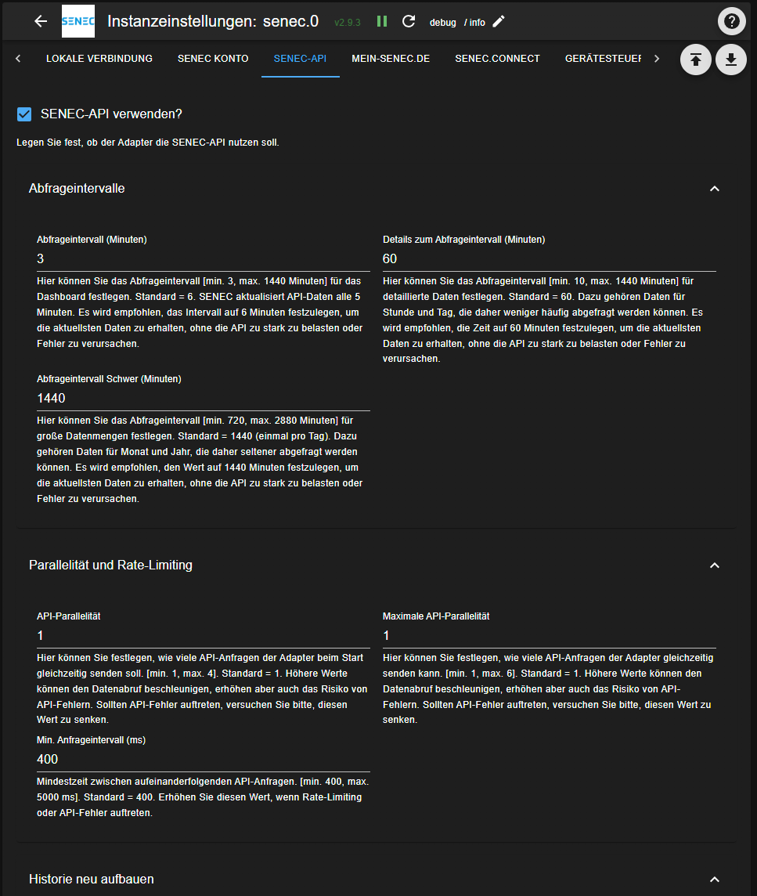

| Einstellung | Beschreibung | Standard |
|-------------|-------------|----------|
| SENEC App API nutzen | Cloud-API-Abfrage aktivieren | Aus |
| Dashboard-Intervall | Abfrageintervall für Dashboard/aktuelle Daten (Minuten) | 6 |
| Detail-Intervall | Abfrageintervall für Tagesmesswerte (Minuten) | 60 |
| Heavy-Intervall | Abfrageintervall für Monats-/Jahresmesswerte (Minuten) | 1440 (24h) |
| Parallelität / Max. Parallelität | Limits für parallele API-Anfragen | 1 / 1 |
| Min. Anfrageintervall | Mindestzeit zwischen API-Anfragen (ms) | 400 |

#### History Rebuild

Der API-Konnektor kann historische Messdaten (AllTime-Summen) komplett neu aufbauen. Konfigurieren Sie bei Bedarf den Rebuild-Modus und das Startjahr. Dies läuft als Hintergrundprozess während des Heavy-Polling-Zyklus.

### mein-senec.de

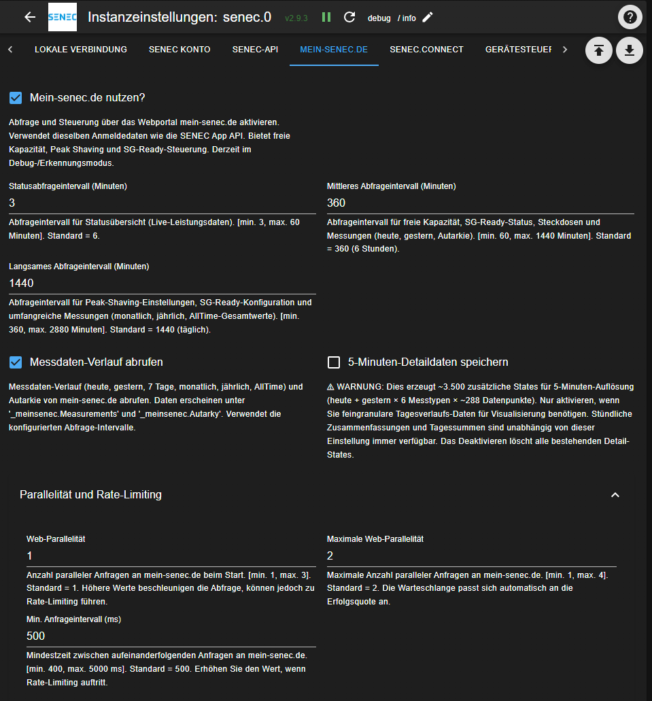

| Einstellung | Beschreibung | Standard |
|-------------|-------------|----------|
| mein-senec.de nutzen | Web-Portal-Abfrage aktivieren | Aus |
| Status-Intervall | Abfrageintervall für Statusdaten (Minuten) | 6 |
| Medium-Intervall | Abfrageintervall für Gestern/Autarkie/Reservekapazität (Minuten) | 360 (6h) |
| Slow-Intervall | Abfrageintervall für Monats-/Jahres-/AllTime-Daten (Minuten) | 1440 (24h) |
| Messverlauf abfragen | Messdatenabfrage aktivieren | Aus |
| 5-Min-Detaildaten einbeziehen | Feingranulare Detaildaten abfragen (~3.500 zusätzliche States) | Aus |
| Parallelität / Max. Parallelität | Limits für parallele Anfragen | 1 / 2 |
| Min. Anfrageintervall | Mindestzeit zwischen Anfragen (ms) | 500 |

### SENEC.Connect

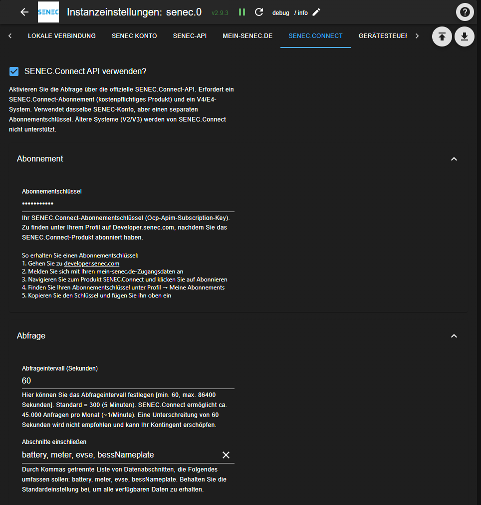

| Einstellung | Beschreibung | Standard |
|-------------|-------------|----------|
| SENEC.Connect nutzen | Azure-API-Abfrage aktivieren | Aus |
| Abfrageintervall | Abfragefrequenz (Sekunden) | 300 |
| Subscription Key | Azure API Subscription Key | — |
| Enthaltene Bereiche | Welche Datenbereiche abgefragt werden | battery,meter |

### Gerätesteuerung

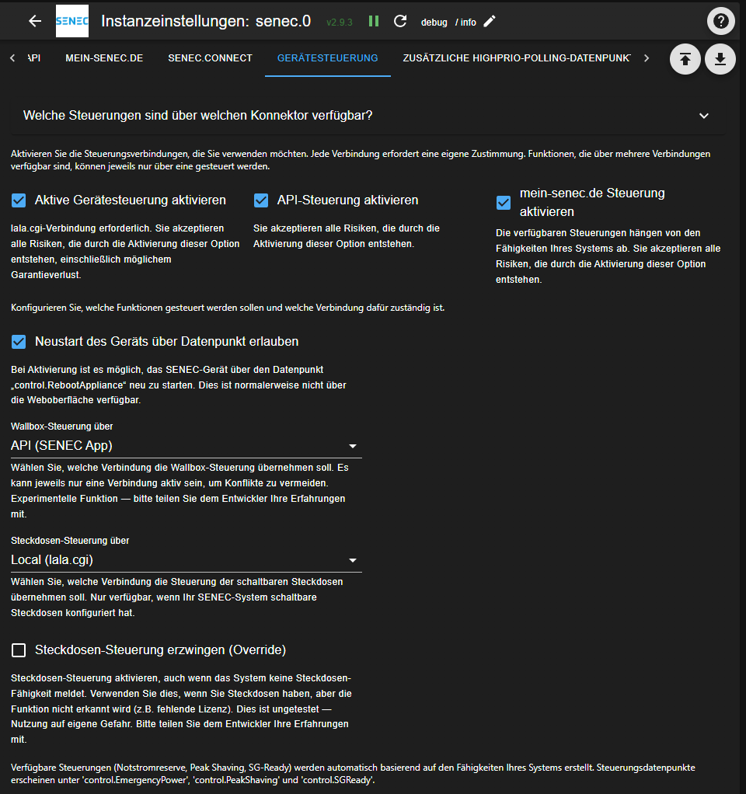

Steuerungsfunktionen ermöglichen das Ändern von Einstellungen am SENEC Gerät. Jede Steuerung ist über bestimmte Konnektoren verfügbar:

| Steuerung | Lokal | API | Web |
|-----------|:-----:|:---:|:---:|
| Akku-Zwangsladung | x | | |
| Entladung blockieren | x | | |
| Gerät neustarten | x | | |
| Notstromreserve | | | x |
| Peak Shaving | | | x |
| SG-Ready | | | x |
| Schaltbare Steckdosen | x | | x |
| Wallbox-Steuerung | x | x | |

**Nutzung auf eigenes Risiko.** Steuerungsfunktionen müssen in den Einstellungen explizit mit Haftungsausschluss aktiviert werden. Der Adapter schützt nicht vor widersprüchlichen Befehlen von mehreren Konnektoren.

### Debug & Logging

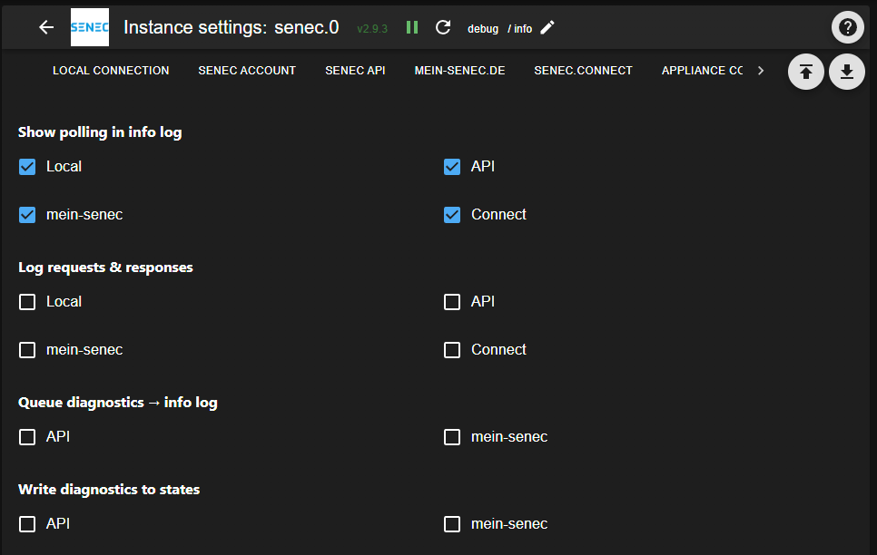

Konfigurierbar pro Konnektor (Lokal, API, mein-senec.de, Connect):

- **Polling im Info-Log anzeigen** — Zeigt Polling-Statusmeldungen im Info-Log statt nur im Debug-Log
- **Requests & Responses loggen** — Loggt HTTP-Details auf Debug-Ebene (kann sensible Daten enthalten)
- **Queue-Diagnose ins Info-Log** — Zeigt Queue-Statistiken im Info-Log (nur API + Web)
- **Diagnose in States schreiben** — Schreibt Queue-Daten in dedizierte ioBroker-States (nur API + Web)

## Integriertes Dashboard

Der Adapter enthält ein vollständiges Web-Dashboard, erreichbar unter `http://<iobroker-ip>:8082/senec/`. Es benötigt den ioBroker.web Adapter und erscheint auf der ioBroker.web Startseite.

Funktionen:
- Dunkles und helles Design (umschaltbar in der Titelleiste)
- Internationalisierung — 11 Sprachen, folgt der Browser-Spracheinstellung
- Echtzeit-Updates über socket.io State-Subscriptions
- Daten von allen Konnektoren mit Quell-Badges
- Tastaturzugänglich (Tab-Navigation, ARIA-Labels)

### Übersicht-Tab

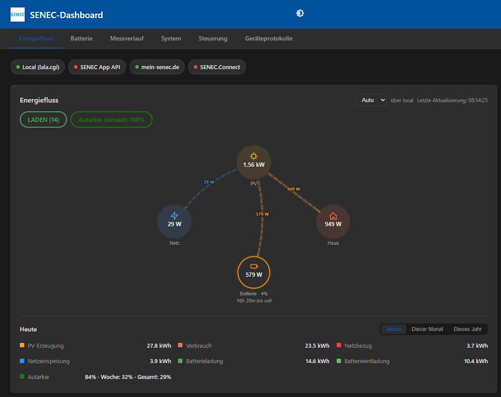

**Energiefluss-Diagramm** — Live-SVG-Visualisierung der Energieflüsse zwischen PV, Batterie, Netz, Haus und Wallbox. Animierte Flusspfade mit leistungsproportionaler Dicke. Batterie-SOC-Anzeige mit Füllstand. Betriebsmodus-Badge. Zeitschätzungen (bis leer/voll). Periodensummen (Heute/Monat/Jahr) mit Autarkie-Prozent. Datenquellen-Auswahl (Auto/Lokal/API/Web).

**Live-Leistungskurve** — Echtzeit-Liniendiagramm der Leistung über die Zeit für alle fünf Messwerte (PV, Haus, Netz, Batterie, Wallbox). Glatte monotone kubische Interpolation zwischen Datenpunkten. Zeitfenster von 10 Minuten bis 24 Stunden. Einzelne Linien ein-/ausblendbar. Pause-/Deaktivierungsschalter. Bei aktiviertem History-Adapter (InfluxDB, SQL oder History) auf den Leistungs-States wird das Diagramm beim Laden mit historischen Daten vorbefüllt.

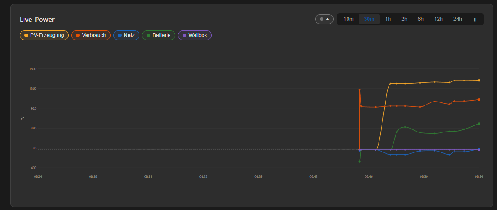

**Ereignis-Timeline** — Kompakter 24-Stunden-Streifen mit heutigen Warnungen (orange), Fehlern (rot) und Panics (lila) aus dem Geräte-Log. Hover für Details. Automatische Aktualisierung alle 10 Minuten. Erfordert eine konfigurierte Geräte-IP.

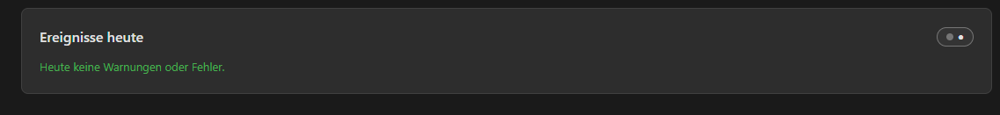

### Batterie-Tab

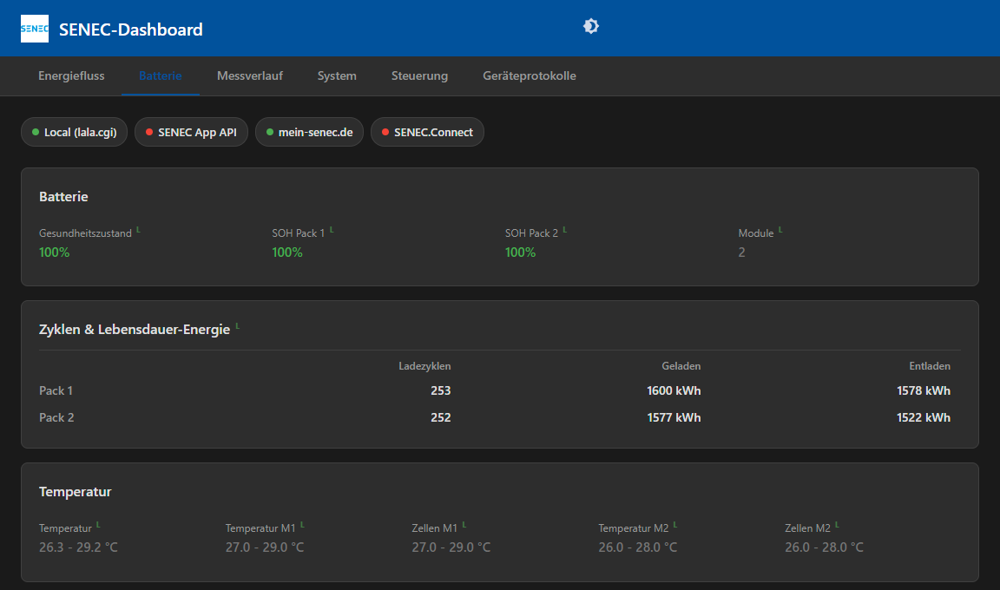

- **Zustandsbericht (SOH)** — System- und pro-Pack-SOH mit farbkodierten Indikatoren (grün > 80%, orange > 60%, rot)
- **Modulstatus** — Anzahl aktiver/ladender/entladender Module
- **Ladezyklen** — Pro-Pack Zyklenanzahl und Lebensdauer-Energie (geladen/entladen)
- **Zellspannungs-Heatmap** — Farbkodiertes Raster der einzelnen Zellspannungen über alle Module. Rot = niedrigste, Grün = höchste. Pro-Modul-Delta-Indikatoren. Macht Zellimbalancen sofort sichtbar.
- **Temperaturen** — Gesamt, pro Modul und pro Zelle
- **Pack-Elektrik** — Pro-Pack Spannung und Strom

Daten aus Lokal (BMS) und/oder API (SystemDetails) mit Quell-Badges.

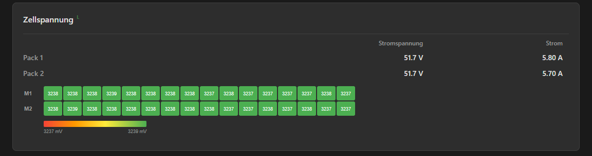

### Diagramme-Tab

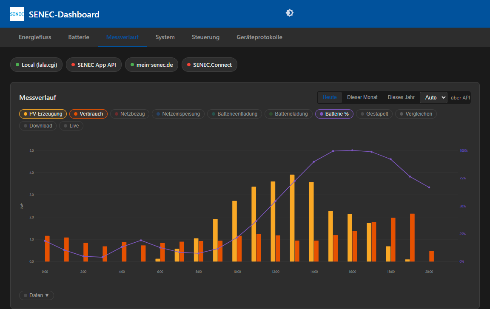

Balkendiagramme für Energiemessdaten:
- **Heute** — Stundenbalken (automatisch auf Stunden mit Daten beschränkt)
- **Dieser Monat** — Tagesbalken
- **Dieses Jahr** — Monatsbalken

Funktionen:
- Einzelne Messtypen ein-/ausblendbar (PV, Verbrauch, Netzbezug/-einspeisung, Batterieladung/-entladung)
- Gestapelte Ansicht (Erzeugung vs. Verbrauch)
- Vergleichsmodus (Gestern, Vormonat, wählbares Jahr)
- Batteriestand (%) Linienoverlay (nur API)
- Datenquellen-Auswahl (Auto/API/Web)
- Datentabelle
- PNG-Bildexport
- Auto-Update-Modus

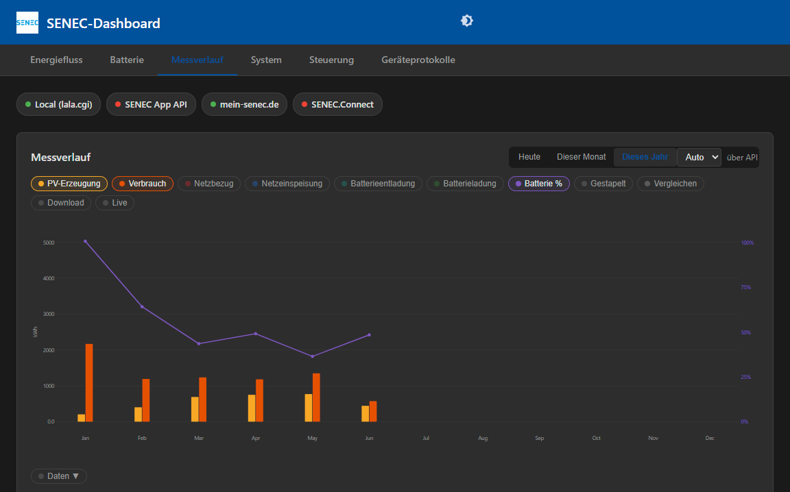

### System-Tab

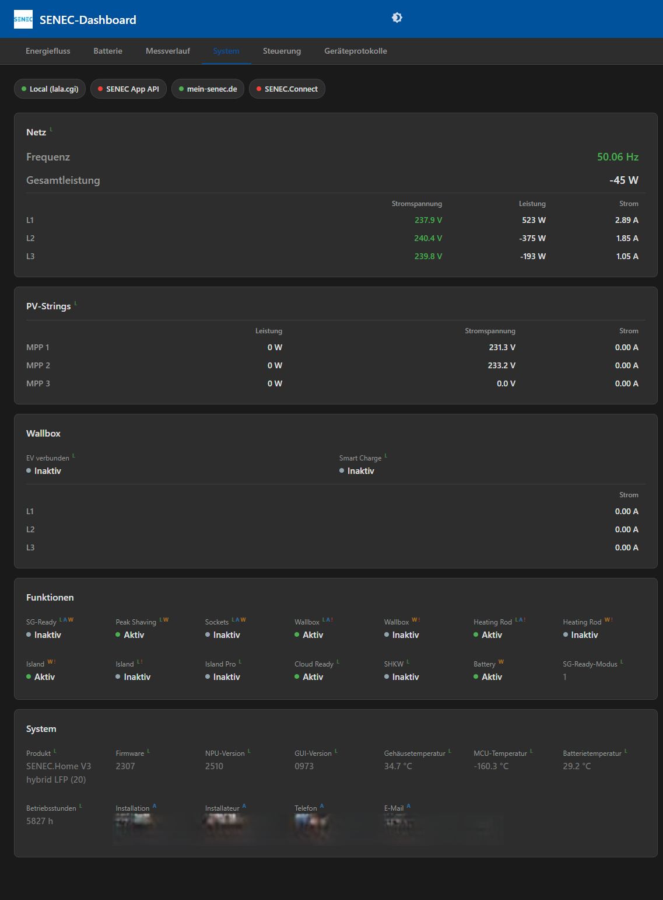

- **Netzqualität** — Frequenz, Gesamtleistung, pro-Phase Spannung/Leistung/Strom. Unterstützt EnFluRi 1 und EnFluRi 2 (automatische Erkennung).
- **PV-Strings** — Pro-Tracker MPP-Leistung, Spannung und Strom
- **Wallbox** — EV-Verbindungsstatus, Smart Charge, pro-Phase Ladestrom
- **Feature-Flags** — Aktive Funktionen pro Konnektor mit Abweichungserkennung
- **Systemdetails** — Produkt, Firmware, GUI/NPU-Version, Wechselrichter-Status, Temperaturen (Gehäuse, MCU, Batterie, Wechselrichter), Betriebsstunden, Installationsdatum, Installateurskontakt

Quell-Badges zeigen an, welcher Konnektor den jeweiligen Wert liefert.

### Steuerung-Tab

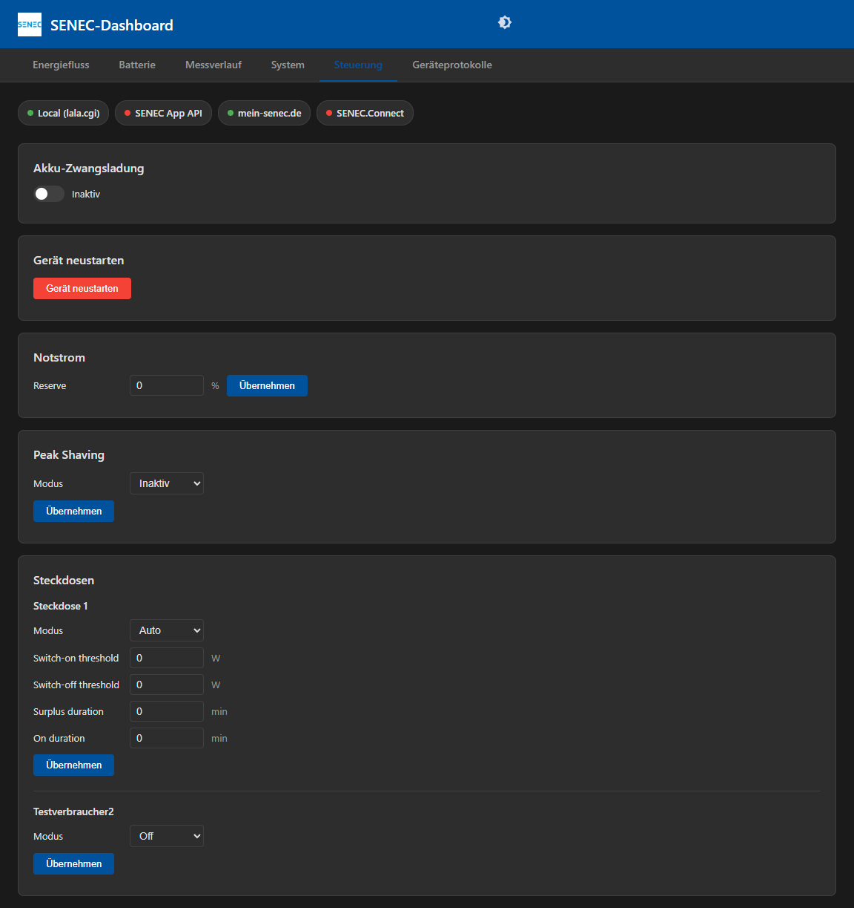

Interaktive Steuerung passend zu den Steuerungsfähigkeiten des Adapters:
- Akku-Zwangsladung (Schalter)
- Gerät neustarten (mit Bestätigungsdialog)
- Notstromreserve (Prozenteinstellung)
- Peak Shaving (modusabhängige Felder)
- SG-Ready (Aktivierung + Schwellwerte)
- Schaltbare Steckdosen (pro Steckdose Modus, Schwellwerte, Namensbearbeitung)
- Wallbox (Smart Charge, Stromgrenze)

Steuerungen prüfen die Konnektor-Verfügbarkeit und zeigen Warnungen wenn der benötigte Konnektor nicht aktiv ist. Die Übernehmen-Schaltfläche gibt "Gesendet"-Feedback.

### Protokolle-Tab

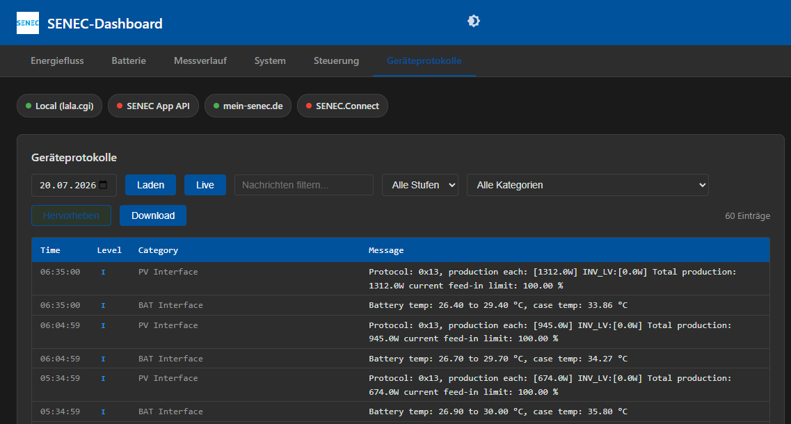

Durchsuchen der SENEC Geräteprotokolle nach Datum:
- Filterbare Tabelle (Zeit, Stufe, Kategorie, Nachricht)
- Stufenfilter: Info, Warnung, Fehler, Panik
- Kategoriefilter (automatisch aus Logeinträgen befüllt)
- Freitextsuche
- Farbkodierte Zeilenhervorhebung nach Schweregrad
- Neueste Einträge zuerst
- Live-Modus — aktualisiert automatisch das heutige Log (UTC-berücksichtigt)
- Download der rohen Logdateien

Erfordert eine konfigurierte Geräte-IP (auch wenn der lokale Konnektor nicht aktiviert ist).

## State-Referenz

Der Adapter erstellt States, organisiert nach Konnektor und Datenbereich. Alle States sind schreibgeschützt, sofern nicht explizit als Steuerungs-States gekennzeichnet.

### Verbindung & Status (`info.*`)

| State | Beschreibung |
|-------|-------------|
| `info.connection` | Gesamtverbindungsstatus (true wenn ein Konnektor aktiv) |
| `info.localConnected` | Lokal (lala.cgi) Verbindungsstatus |
| `info.apiConnected` | SENEC App API Verbindungsstatus |
| `info.webConnected` | mein-senec.de Verbindungsstatus |
| `info.connectConnected` | SENEC.Connect Verbindungsstatus |
| `info.lastPoll.HighPrio` | Zeitstempel der letzten hochprioritären lokalen Abfrage |
| `info.lastPoll.LowPrio` | Zeitstempel der letzten niedrigprioritären lokalen Abfrage |

### Lokale States

Daten aus der lala.cgi-Abfrage werden direkt unter dem Bereichsnamen gespeichert (z.B. `ENERGY.*`, `BMS.*`, `PV1.*`, `WIZARD.*`).

**Wichtige ENERGY-States:**

| State | Typ | Beschreibung |
|-------|-----|-------------|
| `ENERGY.GUI_INVERTER_POWER` | Zahl (W) | Aktuelle PV-Erzeugung |
| `ENERGY.GUI_BAT_DATA_POWER` | Zahl (W) | Batterieleistung (positiv = Laden, negativ = Entladen) |
| `ENERGY.GUI_GRID_POW` | Zahl (W) | Netzleistung (positiv = Bezug, negativ = Einspeisung) |
| `ENERGY.GUI_HOUSE_POW` | Zahl (W) | Aktueller Hausverbrauch |
| `ENERGY.GUI_BAT_DATA_FUEL_CHARGE` | Zahl (%) | Batterie-Ladezustand |
| `ENERGY.STAT_STATE` | Zahl | Betriebszustandscode |
| `ENERGY.STAT_STATE_Text` | Text | Betriebszustand in Klartext |
| `ENERGY.STAT_HOURS_OF_OPERATION` | Zahl (h) | Betriebsstunden |

**Wichtige BMS-States:**

| State | Typ | Beschreibung |
|-------|-----|-------------|
| `BMS.MODULE_COUNT` | Zahl | Anzahl der Batteriemodule |
| `BMS.SOH.{n}` | Zahl (%) | Gesundheitszustand pro Modul |
| `BMS.CYCLES.{n}` | Zahl | Ladezyklen pro Modul |
| `BMS.CELL_VOLTAGES_MODULE_{A-D}.{n}` | Zahl (mV) | Einzelne Zellspannungen |
| `BMS.TEMP_MIN.{n}` / `BMS.TEMP_MAX.{n}` | Zahl (°C) | Modul-Temperaturbereich |
| `BMS.VOLTAGE.{n}` / `BMS.CURRENT.{n}` | Zahl (V/A) | Pack-Spannung und -Strom |

### API-States (`_api.*`)

Cloud-API-Daten werden unter `_api.Anlagen.{systemId}.*` gespeichert:

- `Dashboard.currently.*` — Echtzeit-Leistungswerte (W)
- `Measurements.Daily.*` — Stündliche Messdaten (kWh)
- `Measurements.Monthly.*` — Tägliche Messdaten (kWh)
- `Measurements.Yearly.*` — Monatliche Messdaten (kWh)
- `Measurements.AllTime.*` — Lebensdauer-Summen (kWh)
- `SystemDetails.*` — Batteriedetails, Temperaturen, Firmware
- `SystemStatus.*` — Betriebszustand, Feature-Flags

### Web-States (`_meinsenec.*`)

mein-senec.de Daten werden unter `_meinsenec.*` gespeichert:

- `Status.*` — Aktuelle Leistungswerte (kW), Betriebszustand
- `Measurements.*` — Historische Messdaten (kWh)
- `Autarky.*` — Autarkie-Prozentsätze (Tag/Woche/Monat/Jahr/Gesamt)
- `EmergencyPower.*` — Notstromreserve-Einstellungen
- `PeakShaving.*` — Peak-Shaving-Konfiguration
- `SGReady.*` — SG-Ready-Einstellungen
- `Sockets.*` — States der schaltbaren Steckdosen

### Connect-States (`_connect.*`)

SENEC.Connect Daten werden unter `_connect.Systems.{n}.*` mit Batterie- und Zähler-Unterbereichen gespeichert.

### Steuerungs-States (`control.*`)

Schreibbare States zur Gerätesteuerung:

| State | Typ | Beschreibung |
|-------|-----|-------------|
| `control.ForceCharge` | Boolean | Akku-Zwangsladung ein/aus |
| `control.BlockDischarge` | Boolean | Entladung blockieren ein/aus |
| `control.RebootAppliance` | Boolean | Gerät neustarten auslösen |
| `control.EmergencyPower.ReserveInPercent` | Zahl | Notstromreserve (%) |
| `control.PeakShaving.*` | Diverse | Peak-Shaving-Einstellungen |
| `control.SGReady.*` | Diverse | SG-Ready-Einstellungen |
| `control.Sockets.{n}.*` | Diverse | Pro-Steckdose Steuerung |
| `control.Wallbox.{n}.*` | Diverse | Wallbox-Steuerung |

Steuerungs-States werden nur erstellt, wenn die entsprechende Funktion aktiviert und über den konfigurierten Konnektor verfügbar ist.

## Fehlerbehebung

**Gerät reagiert nicht / häufige Neustarts**: Reduzieren Sie das hochprioritäre Abfrageintervall oder entfernen Sie benutzerdefinierte HighPrio-Datenpunkte. Das SENEC Gerät hat begrenzte Ressourcen.

**Keine Daten von API/Web**: Prüfen Sie Ihre mein-senec.de Zugangsdaten im SENEC Konto Tab. Der Adapter protokolliert Authentifizierungsfehler auf Warnungsstufe.

**Dashboard lädt nicht**: Stellen Sie sicher, dass ioBroker.web auf Port 8082 läuft. Das Dashboard wird als Web-Extension unter `/senec/` bereitgestellt.

**Fehlende States**: Die verfügbaren States hängen von Ihrem SENEC Modell, der Firmware-Version und den konfigurierten Konnektoren ab. Nicht alle States sind auf allen Systemen verfügbar.

**Steuerungs-States erscheinen nicht**: Steuerungsfunktionen müssen in den Gerätesteuerungseinstellungen explizit aktiviert werden. Jede Steuerung erfordert einen bestimmten aktiven Konnektor.
