#  ioBroker.senec

## SENEC Adapter für ioBroker

Überwachen und steuern Sie Ihr SENEC Heimspeichersystem. Der Adapter unterstützt vier unabhängige Konnektoren, die einzeln oder kombiniert genutzt werden können:

- **Lokal** (lala.cgi) — Direkte LAN-Abfrage mit 10-Sekunden-Echtzeitdaten. Liefert vollständige BMS-Daten, Netzzähler, Wallbox-Daten und Gerätesteuerung.
- **SENEC App API** — Cloud-basierte Abfrage über die SENEC App API. Dashboard-Daten, Messverlauf, Systemdetails und Wallbox-Informationen.
- **mein-senec.de** — Web-Portal-Abfrage. Statusübersicht, Messverlauf, Autarkie, Notstrom, Peak Shaving, SG-Ready und Steuerung schaltbarer Steckdosen.
- **SENEC.Connect** — Azure-basierte API. Batterie- und Zählerdaten über Subscription-Key.

Es müssen nicht alle Konnektoren aktiviert werden. Wählen Sie je nach Bedarf — rein lokale Setups funktionieren ebenso wie reine Cloud-Konfigurationen für Systeme ohne lokales Webinterface.

### Unterstützte Systeme

Praktisch jedes SENEC-Speichersystem funktioniert: die Home-Reihe von den frühen Blei- und
Lithium-Modellen über V2, V2.1 und V3 bis zur aktuellen Generation V4 | P4 | E4, die
Business-Modelle sowie die Partnervarianten ADS Tec, OEM LG und Solarinvert.

Systeme mit lokalem Webinterface können alle vier Konnektoren nutzen. Systeme ohne — darunter die
V4-Generation — laufen über die SENEC App API, mein-senec.de und SENEC.Connect. Welche Datenpunkte
verfügbar sind, hängt vom Modell ab.

Die [vollständige Modellliste](../SUPPORTED_SYSTEMS.md) hilft beim Wiederfinden des eigenen Systems.

## Haftungsausschluss
**Alle Produkt- und Firmennamen oder -logos sind Warenzeichen™ oder eingetragene® Warenzeichen der jeweiligen Inhaber. Ihre Verwendung impliziert keine Zugehörigkeit oder Befürwortung durch diese oder zugehörige Tochtergesellschaften! Dieses persönliche Projekt wird in der Freizeit gepflegt und hat kein geschäftliches Ziel.**

**Keine Gewährleistung und keine Haftung.** Dieser Adapter ist ein Freizeitprojekt und wird wie besehen unter der MIT-Lizenz bereitgestellt. Er spricht mit einem teuren Gerät über Schnittstellen, die SENEC weder dokumentiert noch unterstützt, und er kann Befehle senden, die das Verhalten dieses Geräts verändern. Alles, was Sie damit tun, geschieht auf eigene Verantwortung. Der Autor haftet nicht für Schäden an Ihrer Anlage, für verlorene oder falsche Daten, entgangene Einspeisung oder sonstige Folgen der Nutzung — und kann Ihnen auch nicht sagen, ob die Nutzung Auswirkungen auf Gewährleistung oder Support durch SENEC oder Ihren Installateur hat. Wer das nicht akzeptieren möchte, sollte diesen Adapter nicht einsetzen.

## Voraussetzungen

- ioBroker mit Node.js >= 22
- SENEC Speichersystem im lokalen Netzwerk (für lokalen Konnektor)
- mein-senec.de Konto (für API- und Web-Konnektor)
- ioBroker.web Adapter installiert (für das integrierte Dashboard)

## Installation

Installieren Sie den Adapter über das ioBroker Adapter-Repository. Nach der Installation erstellen Sie eine Adapter-Instanz und konfigurieren mindestens einen Konnektor.

## Konfiguration

Die Adaptereinstellungen sind in Tabs organisiert — je einer pro Konnektor sowie allgemeine Einstellungen und Debug-Optionen.

### SENEC Konto

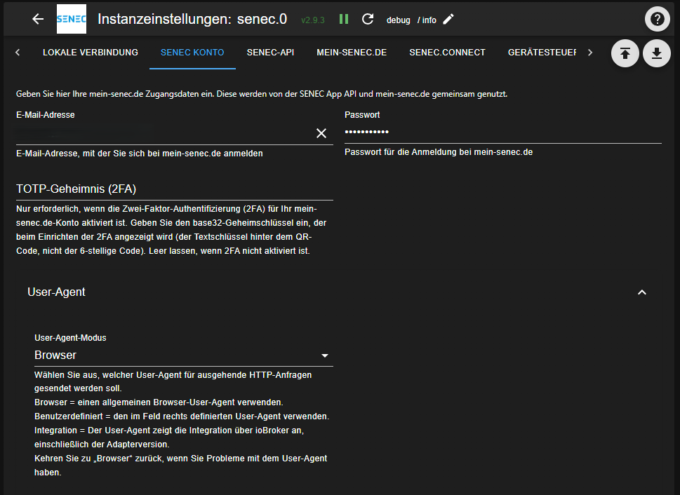

Geben Sie hier Ihre mein-senec.de Zugangsdaten ein. Diese werden von der SENEC App API und mein-senec.de gemeinsam genutzt. Hier lässt sich auch der User-Agent-Modus für ausgehende HTTP-Anfragen konfigurieren.

#### Zwei-Faktor-Authentifizierung (2FA)

Ist für das mein-senec.de-Konto eine Zwei-Faktor-Authentifizierung aktiv, kann sich der Adapter trotzdem selbstständig anmelden — es muss niemand danebensitzen und einen Code eintippen.

Bei der Einrichtung wird ein QR-Code für die Authenticator-App angezeigt und daneben dasselbe Geheimnis als Text. Dieser Text gehört in das Feld **TOTP-Secret**. Notieren Sie ihn, solange die Einrichtungsseite offen ist: Nach dem Aktivieren wird das Geheimnis nicht erneut angezeigt, ein neues gibt es nur durch erneutes Einrichten. Leer- und Bindestriche darin spielen keine Rolle.

Gemeint ist das dauerhafte Geheimnis, nicht der sechsstellige Code aus der App — der wechselt alle dreißig Sekunden und wäre längst abgelaufen, bevor der Adapter ihn verwenden könnte.

Ein Geheimnis genügt für beide Cloud-Konnektoren, da sich beide am selben Konto anmelden. Fehlt der Eintrag, obwohl 2FA verlangt wird, weist der Adapter im Log ausdrücklich darauf hin, statt nur einen fehlgeschlagenen Login zu melden.

### Lokale Verbindung (lala.cgi)

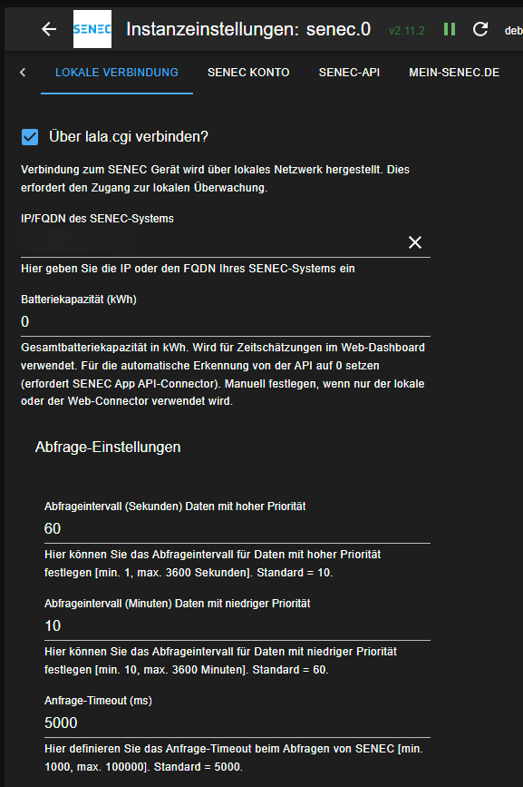

| Einstellung | Beschreibung | Standard |
|-------------|-------------|----------|
| Über lala.cgi verbinden | Lokale Abfrage aktivieren | Ein |
| SENEC System IP | IP-Adresse oder FQDN des SENEC Geräts | — |
| HTTPS verwenden | Aktivieren wenn das Gerät HTTPS nutzt | Aus |

**Abfrage-Einstellungen** aufklappen für Timing-Optionen:

| Einstellung | Beschreibung | Standard |
|-------------|-------------|----------|
| Abfrageintervall (hohe Priorität) | Intervall für Echtzeitdaten (Sekunden) | 10 |
| Abfrageintervall (niedrige Priorität) | Intervall für selten geänderte Daten (Minuten) | 60 |
| Abfrage-Timeout | Zeitlimit für HTTP-Anfragen (ms) | 5000 |

Der Adapter wiederholt automatisch mit exponentiellem Backoff bei Verbindungsfehlern — keine manuelle Konfiguration nötig. Wenn das SENEC Gerät vorübergehend nicht erreichbar ist (Neustart, Firmware-Update), wird die Abfrage automatisch fortgesetzt, sobald das Gerät wieder online ist.

#### TLS-Zertifikatsvalidierung

Der Adapter validiert das HTTPS-Zertifikat des SENEC Geräts mit einem mehrstufigen Verfahren:

1. **Benutzer-CA** — Laden Sie das SenecGui-Root CA-Zertifikat über das Dashboard hoch (System-Tab → TLS-Zertifikat). Herunterladen von mein-senec.de (Dokumente / Allgemeine Dokumente / SenecGui-Root), dann die .pem- oder .zip-Datei hochladen. SENEC verteilt dieses Zertifikat hinter einem Login, daher kann der Adapter es nicht mitliefern.
2. **Zwischengespeichertes CA-Zertifikat** — Falls kein Benutzer-Zertifikat vorhanden ist, kann der Adapter das CA-Zertifikat automatisch von mein-senec.de herunterladen (setzt voraus, dass der mein-senec.de-Connector aktiviert ist). Das heruntergeladene Zertifikat wird im Adapter-State gespeichert und bleibt über Neustarts erhalten.
3. **TOFU (Trust On First Use)** — Falls kein CA-Zertifikat validiert, pinnt der Adapter den Fingerabdruck des Gerätezertifikats beim ersten Kontakt. Folgende Verbindungen werden gegen diesen Fingerabdruck geprüft. Bei Änderung (z.B. nach Firmware-Update) wird eine Warnung protokolliert und der neue Fingerabdruck automatisch übernommen.

Der Adapter probiert jede Stufe der Reihe nach und verwendet die erste, die validiert. Ohne CA-Zertifikat bietet TOFU automatisch sichere Identitätsverifikation — der Upload ist optional.

Falls der automatische CA-Download fehlgeschlagen ist und Sie es erneut versuchen möchten, setzen Sie `_local.tls.certFetchFailed` auf `false` — der Adapter versucht den Download beim nächsten Neustart oder sofort, falls er läuft.

**Wichtig**: Zu häufige Abfragen oder zu viele Datenpunkte können das SENEC Gerät überlasten. Dies kann zu Neustarts, Nicht-Erreichbarkeit oder fehlender Cloud-Synchronisation führen. Bei Problemen die Abfragefrequenz reduzieren oder den Adapter stoppen.

#### Zusätzliche HighPrio-Polling-Datenpunkte

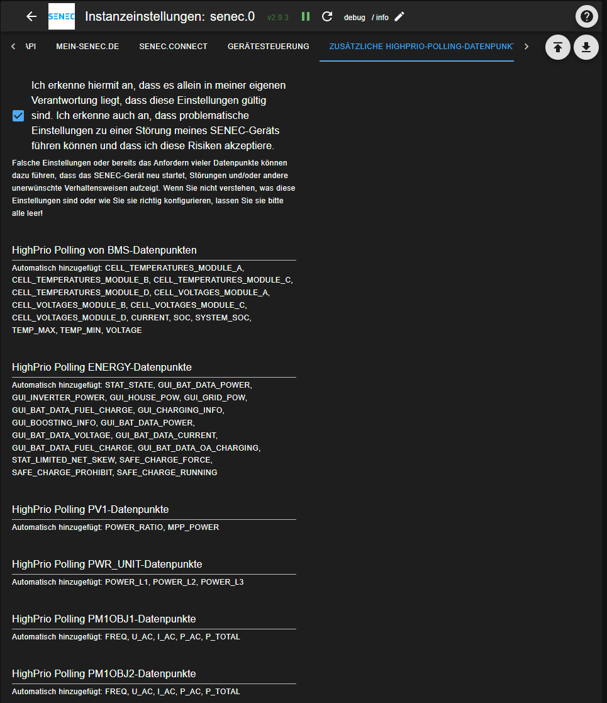

Sie können zusätzliche Datenbereiche (z.B. BMS, PV1, WALLBOX) zum hochprioritären Polling hinzufügen. Dies erfordert die Bestätigung eines Haftungsausschlusses. Es sind nur Zeichen A-Z, Ziffern 0-9 und Kommas erlaubt.

### SENEC App API

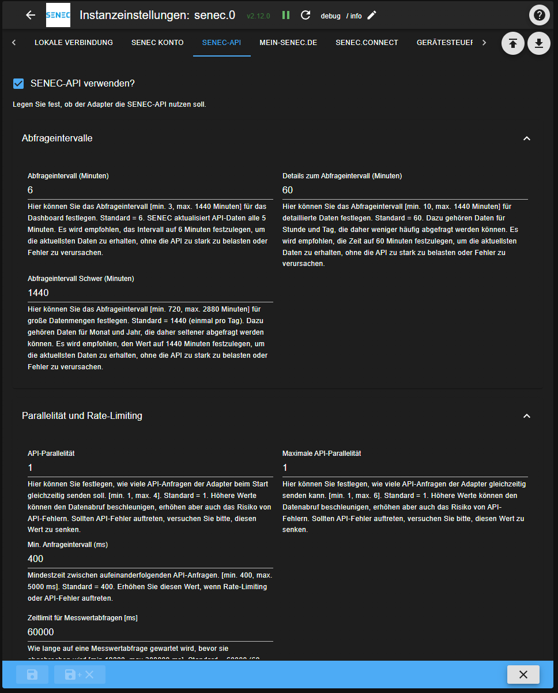

| Einstellung | Beschreibung | Standard |
|-------------|-------------|----------|
| SENEC App API nutzen | Cloud-API-Abfrage aktivieren | Aus |
| Dashboard-Intervall | Abfrageintervall für Dashboard/aktuelle Daten (Minuten) | 6 |
| Detail-Intervall | Abfrageintervall für Tagesmesswerte (Minuten) | 60 |
| Heavy-Intervall | Abfrageintervall für Monats-/Jahresmesswerte (Minuten) | 1440 (24h) |
| Parallelität / Max. Parallelität | Limits für parallele API-Anfragen | 1 / 1 |
| Min. Anfrageintervall | Mindestzeit zwischen API-Anfragen (ms) | 400 |
| Zeitlimit für Messwertabfragen | Wie lange auf eine Messwert-Aggregation gewartet wird (ms). Erhöhen, wenn im Log Heavy-Polls in Timeouts laufen | 60000 |

#### History Rebuild

Der API-Konnektor kann historische Messdaten (AllTime-Summen) komplett neu aufbauen. Konfigurieren Sie bei Bedarf den Rebuild-Modus und das Startjahr. Dies läuft als Hintergrundprozess während des Heavy-Polling-Zyklus.

### mein-senec.de

| Einstellung | Beschreibung | Standard |
|-------------|-------------|----------|
| mein-senec.de nutzen | Web-Portal-Abfrage aktivieren | Aus |
| Status-Intervall | Abfrageintervall für Statusdaten (Minuten) | 6 |
| Medium-Intervall | Abfrageintervall für Gestern/Autarkie/Reservekapazität (Minuten) | 360 (6h) |
| Slow-Intervall | Abfrageintervall für Monats-/Jahres-/AllTime-Daten (Minuten) | 1440 (24h) |
| Messverlauf abfragen | Messdatenabfrage aktivieren | Aus |
| 5-Min-Detaildaten einbeziehen | Feingranulare Detaildaten abfragen (~3.500 zusätzliche States) | Aus |
| Parallelität / Max. Parallelität | Limits für parallele Anfragen | 1 / 2 |
| Min. Anfrageintervall | Mindestzeit zwischen Anfragen (ms) | 500 |

### Weitere Anlagen des Kontos

Sind dem mein-senec.de-Konto mehrere Anlagen zugeordnet — ein ersetztes Gerät bleibt neben seinem Nachfolger sichtbar —, erkennt der Adapter beim Start alle und legt jede unter `_meinsenec.Plants.{steuereinheitnummer}.` an.

Abgefragt wird standardmäßig nur die erste Anlage. Jede weitere erhält einen eigenen Schalter unter `control.Plants.{steuereinheitnummer}.poll`, der zunächst aus ist. Wird er gesetzt, nimmt die langsame Abfrage-Ebene diese Anlage mit auf und füllt dieselbe Messwertstruktur wie bei der Hauptanlage:

| State | Inhalt |
|-------|--------|
| `_meinsenec.Plants.{sn}.System.*` | Produktname, Gerätenummer, Anlagennummer |
| `_meinsenec.Plants.{sn}.Measurements.Daily.today` / `.yesterday` | Stundenwerte |
| `_meinsenec.Plants.{sn}.Measurements.Monthly.*` | Tageswerte je Monat |
| `_meinsenec.Plants.{sn}.Measurements.Yearly.*` | Monatswerte je Jahr |
| `_meinsenec.Plants.{sn}.Measurements.AllTime.*` | Gesamtsummen |
| `_meinsenec.Plants.{sn}.Autarky.*` | Autarkie je Zeitraum |

Die Gesamtsummen werden einmal beim ersten Erkennen einer Anlage geholt, auch bei ausgeschaltetem Schalter — so liegen die Endwerte eines stillgelegten Geräts vor, ohne es dauerhaft abzufragen.

Beachten Sie, dass jede zusätzlich aktivierte Anlage die Anzahl der Portal-Anfragen erhöht. Wer nur die historischen Summen eines Altgeräts braucht, lässt den Schalter am besten aus.

### SENEC.Connect

| Einstellung | Beschreibung | Standard |
|-------------|-------------|----------|
| SENEC.Connect nutzen | Azure-API-Abfrage aktivieren | Aus |
| Abfrageintervall | Abfragefrequenz (Sekunden) | 300 |
| Subscription Key | Azure API Subscription Key | — |
| Enthaltene Bereiche | Welche Datenbereiche abgefragt werden | battery,meter |

### Externe Quellen

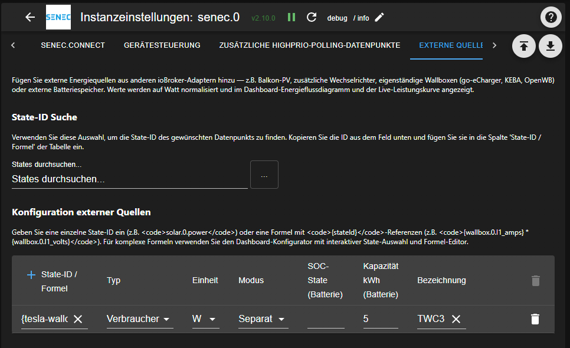

Fügen Sie externe Energiequellen aus anderen ioBroker-Adaptern hinzu — z.B. Balkon-PV, zusätzliche Wechselrichter, eigenständige Wallboxen, Wärmepumpen oder externe Batteriespeicher. Werte werden auf Watt normalisiert und im Dashboard-Energieflussdiagramm und der Live-Leistungskurve angezeigt.

Verwenden Sie die **State-ID Suche** um die State-ID des gewünschten Datenpunkts zu finden und fügen Sie sie in die Tabelle ein.

| Spalte | Beschreibung |
|--------|-------------|
| State-ID / Formel | Einzelne State-ID (z.B. `solar.0.power`) oder Formel mit `{stateId}`-Referenzen (z.B. `{wallbox.0.l1_amps} * {wallbox.0.l1_volts}`) |
| Typ | PV, Verbraucher (Wallbox, Wärmepumpe, etc.) oder Batterie |
| Einheit | W oder kW — wird auf den Endwert angewendet |
| Modus | **Integrieren** = zum SENEC-Gesamtwert addieren (ein Knoten). **Separat** = als eigener Knoten im Energiefluss anzeigen |
| SOC-State | (Nur Batterie) State-ID für den Ladezustand (%) |
| Kapazität | (Nur Batterie) Batteriekapazität in kWh — ermöglicht Zeitschätzungen |
| Bezeichnung | Anzeigename im Energieflussdiagramm |

Formeln unterstützen `+ - * / ( )` Operatoren. State-IDs ohne geschweifte Klammern werden automatisch erkannt wenn sie Rechenoperatoren enthalten. Für komplexe Formeln ist ein Dashboard-basierter Konfigurator mit interaktiver State-Auswahl geplant.

### Gerätesteuerung

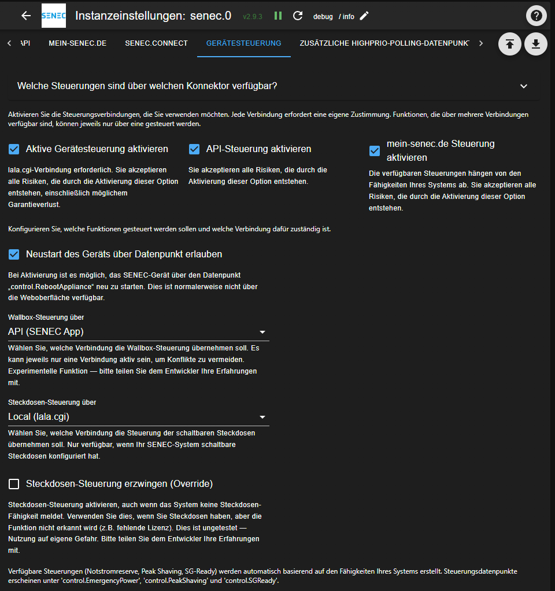

Steuerungsfunktionen ermöglichen das Ändern von Einstellungen am SENEC Gerät. Jede Steuerung ist über bestimmte Konnektoren verfügbar:

| Steuerung | Lokal | API | Web |
|-----------|:-----:|:---:|:---:|
| Akku-Zwangsladung | x | | |
| Entladung blockieren | x | | |
| Gerät neustarten | x | | |
| Notstromreserve | | | x |
| Peak Shaving | | | x |
| SG-Ready | | | x |
| Schaltbare Steckdosen | x | | x |
| Wallbox-Steuerung | x | x | |

**Nutzung auf eigenes Risiko.** Steuerungsfunktionen müssen in den Einstellungen explizit mit Haftungsausschluss aktiviert werden. Der Adapter schützt nicht vor widersprüchlichen Befehlen von mehreren Konnektoren.

### Debug & Logging

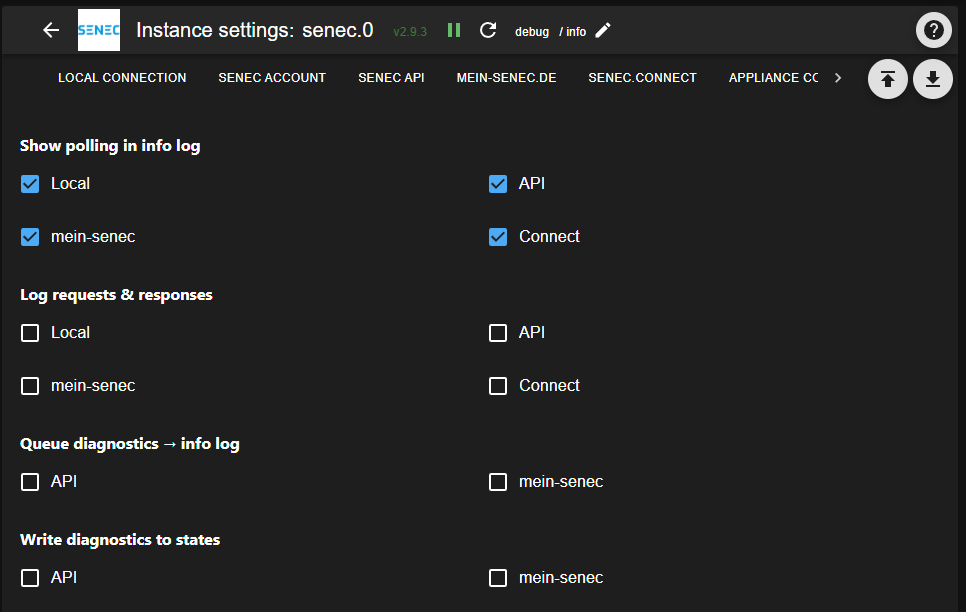

Konfigurierbar pro Konnektor (Lokal, API, mein-senec.de, Connect):

- **Polling im Info-Log anzeigen** — Zeigt Polling-Statusmeldungen im Info-Log statt nur im Debug-Log
- **Requests & Responses loggen** — Loggt HTTP-Details auf Debug-Ebene (kann sensible Daten enthalten)
- **Queue-Diagnose ins Info-Log** — Zeigt Queue-Statistiken im Info-Log (nur API + Web)
- **Diagnose in States schreiben** — Schreibt Queue-Daten in dedizierte ioBroker-States (nur API + Web)

#### Debug-Log erstellen

Die meisten Probleme lassen sich aus einem Log ablesen, und fast keines ohne.

1. Log-Level der Instanz auf **debug** setzen: ioBroker-Admin → Instanzen → senec-Instanz → Auswahlfeld für den Log-Level. `silly` gibt es auch, bringt aber selten mehr Erkenntnis und erzeugt sehr viel Rauschen.
2. Im Adapter-Tab **Debug & Protokollierung** für den betroffenen Konnektor *Anfragen & Antworten protokollieren* aktivieren. Diese Einstellung macht aus „eine Anfrage ist fehlgeschlagen" ein „diese URL hat mit diesem Status geantwortet".
3. Lange genug laufen lassen, damit das Problem mindestens einmal auftritt. Bei den langsamen Abfrage-Ebenen — Messwerte, Monats- oder Jahresdaten — kann das bedeuten, auf den nächsten Zyklus zu warten statt neu zu starten.
4. Das Log aus dem ioBroker-Log-Tab kopieren oder die Datei aus `/opt/iobroker/log/` verwenden.
5. Anschließend wieder auf **info** zurückstellen. Debug-Logging ist umfangreich und füllt über Wochen die Festplatte.

**Vor dem Weitergeben bitte durchsehen.** Die Anfrage-Protokollierung enthält URLs und Antworten, darin können Anlagen-ID, Anlagennummer und Seriennummer stehen. Passwörter sind nicht dabei, aber es sind Ihre Daten. Ersetzen Sie, was nicht öffentlich werden soll.

#### Fehler melden

Meldungen bitte über [GitHub](https://github.com/nobl/ioBroker.senec/issues). Was eine Meldung schnell bearbeitbar macht:

- **Welches System** — Modell und, falls bekannt, die Firmware-Version (`_local.FACTORY` und `_local.SYS_UPDATE` enthalten beides, sofern der lokale Konnektor läuft)
- **Welche Konnektoren** aktiv sind, denn dasselbe Symptom hat lokal und in der Cloud unterschiedliche Ursachen
- **Adapter- und ioBroker-Version** sowie die Node.js-Version
- **Was erwartet wurde und was stattdessen passiert ist** — „der Batteriestand fehlt" lässt sich bearbeiten, „geht nicht" erfordert erst eine Rückfrage
- **Der passende Log-Ausschnitt** auf Debug-Level, mit ein paar Zeilen vor und nach dem Fehler statt nur der Fehlerzeile

Vorab noch: Unplausible Werte stammen meist vom Gerät und nicht vom Adapter. Er reicht Werte weitgehend durch, eine im Dashboard falsch wirkende Temperatur oder ein falscher Ladezustand sieht deshalb in der Weboberfläche des Geräts in der Regel genauso falsch aus. Ein Blick dorthin klärt die Frage oft schon — und wenn nicht, ist genau dieser Vergleich die nützlichste Angabe in der Meldung.

## Integriertes Dashboard

Der Adapter enthält ein vollständiges Web-Dashboard, erreichbar unter `http://<iobroker-ip>:8082/senec/`. Es benötigt den ioBroker.web Adapter und erscheint auf der ioBroker.web Startseite.

Funktionen:
- Dunkles und helles Design (umschaltbar in der Titelleiste)
- Internationalisierung — 11 Sprachen, folgt der Browser-Spracheinstellung
- Echtzeit-Updates über socket.io State-Subscriptions
- Daten von allen Konnektoren mit Quell-Badges
- Tastaturzugänglich (Tab-Navigation, ARIA-Labels)

### Übersicht-Tab

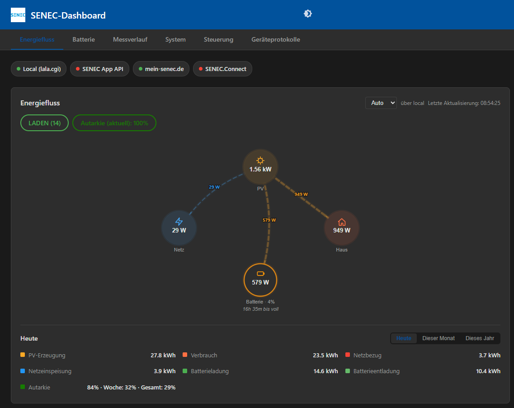

**Energiefluss-Diagramm** — Live-SVG-Visualisierung der Energieflüsse zwischen PV, Batterie, Netz, Haus und Wallbox. Animierte Flusspfade mit leistungsproportionaler Dicke. Batterie-SOC-Anzeige mit Füllstand. Betriebsmodus-Badge. Zeitschätzungen (bis leer/voll). Periodensummen (Heute/Monat/Jahr) mit Autarkie-Prozent. Datenquellen-Auswahl (Auto/Lokal/API/Web).

**Live-Leistungskurve** — Echtzeit-Liniendiagramm der Leistung über die Zeit für alle fünf Messwerte (PV, Haus, Netz, Batterie, Wallbox). Glatte monotone kubische Interpolation zwischen Datenpunkten. Zeitfenster-Voreinstellungen von 10 Minuten bis 24 Stunden, plus Mausrad-Zoom (5min–30 Tage, heruntergesampelt für Performance). Ziehen zum Blättern durch die Historie mit Lazy-Loading und Mitternachts-Datumsmarkern. Einzelne Linien ein-/ausblendbar, inklusive einer optionalen Ladezustandslinie (standardmäßig aus) auf einer eigenen rechten 0–100-%-Achse. Pause-/Deaktivierungsschalter. „Live"-Button zum Zurückspringen zur Echtzeit. Bei aktiviertem History-Adapter (InfluxDB, SQL oder History) auf den Leistungs-States wird das Diagramm beim Laden mit historischen Daten vorbefüllt. Jeder State wird einzeln aufgelöst — States können also von unterschiedlichen History-Adaptern aufgezeichnet werden, und ein nicht aufgezeichneter State betrifft nur seine eigene Linie. Der ⓘ-Button listet die States hinter jeder Linie zusammen mit dem aufzeichnenden History-Adapter auf — damit lässt sich nachvollziehen, warum eine Linie keine Vergangenheitsdaten hat.

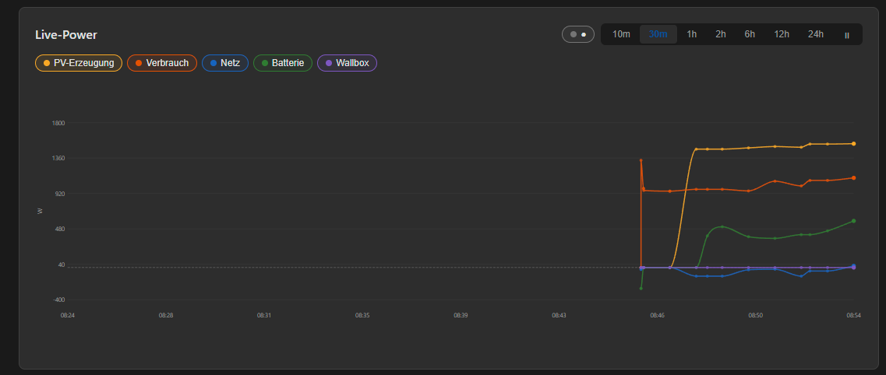

**Ereignis-Timeline** — Kompakter 24-Stunden-Streifen mit heutigen Warnungen (orange), Fehlern (rot) und Panics (lila) aus dem Geräte-Log. Hover für Details. Automatische Aktualisierung alle 10 Minuten. Erfordert eine konfigurierte Geräte-IP.

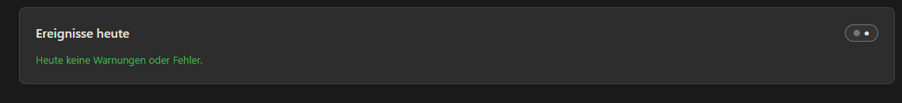

### Batterie-Tab

- **Zustandsbericht (SOH)** — System- und pro-Pack-SOH mit farbkodierten Indikatoren (grün > 80%, orange > 60%, rot)
- **Modulstatus** — Anzahl aktiver/ladender/entladender Module
- **Ladezyklen** — Pro-Pack Zyklenanzahl und Lebensdauer-Energie (geladen/entladen)
- **Zellspannungs-Heatmap** — Farbkodiertes Raster der einzelnen Zellspannungen über alle Module. Rot = niedrigste, Grün = höchste. Pro-Modul-Delta-Indikatoren. Macht Zellimbalancen sofort sichtbar.
- **Temperaturen** — Gesamt, pro Modul und pro Zelle
- **Pack-Elektrik** — Pro-Pack Spannung und Strom

Daten aus Lokal (BMS) und/oder API (SystemDetails) mit Quell-Badges.

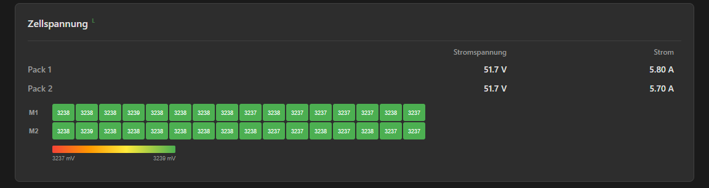

### Diagramme-Tab

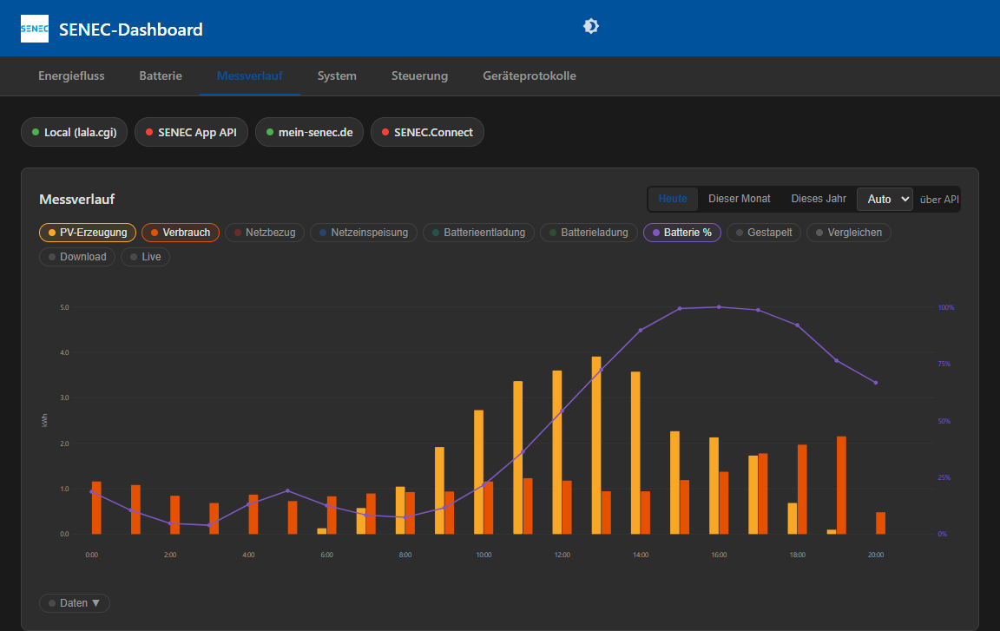

Balkendiagramme für Energiemessdaten:
- **Heute** — Stundenbalken (automatisch auf Stunden mit Daten beschränkt)
- **Dieser Monat** — Tagesbalken
- **Dieses Jahr** — Monatsbalken

Funktionen:
- Einzelne Messtypen ein-/ausblendbar (PV, Verbrauch, Netzbezug/-einspeisung, Batterieladung/-entladung)
- Gestapelte Ansicht (Erzeugung vs. Verbrauch)
- Vergleichsmodus (Gestern, Vormonat, wählbares Jahr)
- Batteriestand (%) Linienoverlay. Der API-Konnektor liest ihn aus der Messwert-Historie. mein-senec.de bietet keine solche Historie, daher tastet der Web-Konnektor stattdessen den Live-Ladezustand ab: Stundenmittel für die Tagesansicht, Tagesmittel für die Monatsansicht. Diese Werte beginnen folglich erst mit dem Adapterbetrieb — für einen Tag, an dem der Adapter über Mitternacht nicht lief, existiert kein Tagesmittel, und es lässt sich auch nicht nachträglich abrufen. Die Jahresansicht hat beim Web-Konnektor keinen Batteriestand.
- Datenquellen-Auswahl (Auto/API/Web)
- Datentabelle
- PNG-Bildexport
- Auto-Update-Modus

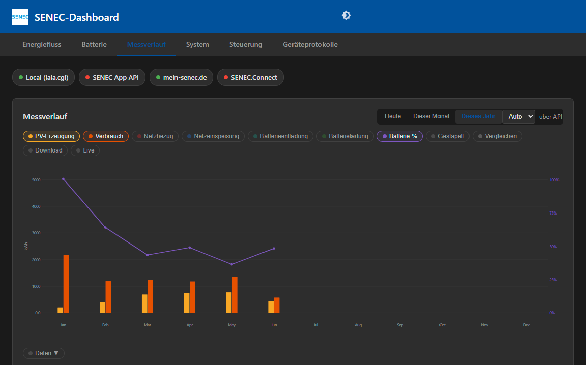

### System-Tab

- **Netzqualität** — Frequenz, Gesamtleistung, pro-Phase Spannung/Leistung/Strom. Unterstützt EnFluRi 1 und EnFluRi 2 (automatische Erkennung).
- **PV-Strings** — Pro-Tracker MPP-Leistung, Spannung und Strom
- **Wallbox** — EV-Verbindungsstatus, Smart Charge, pro-Phase Ladestrom
- **Feature-Flags** — Aktive Funktionen pro Konnektor mit Abweichungserkennung
- **Systemdetails** — Produkt, Firmware, GUI/NPU-Version, Wechselrichter-Status, Temperaturen (Gehäuse, MCU, Batterie, Wechselrichter), Betriebsstunden, Installationsdatum, Installateurskontakt

Quell-Badges zeigen an, welcher Konnektor den jeweiligen Wert liefert.

### Steuerung-Tab

Interaktive Steuerung passend zu den Steuerungsfähigkeiten des Adapters:
- Akku-Zwangsladung (Schalter)
- Gerät neustarten (mit Bestätigungsdialog)
- Notstromreserve (Prozenteinstellung)
- Peak Shaving (modusabhängige Felder)
- SG-Ready (Aktivierung + Schwellwerte)
- Schaltbare Steckdosen (pro Steckdose Modus, Schwellwerte, Namensbearbeitung)
- Wallbox (Smart Charge, Stromgrenze)

Steuerungen prüfen die Konnektor-Verfügbarkeit und zeigen Warnungen wenn der benötigte Konnektor nicht aktiv ist. Die Übernehmen-Schaltfläche gibt "Gesendet"-Feedback.

### Statistik-Tab

mein-senec.de bietet einen wöchentlichen CSV-Export mit 5-Minuten-Auflösung, der Jahre zurückreicht — weit mehr Daten, als in ioBroker-States gehören. Daher wird nichts dauerhaft gespeichert: Der Adapter hält nur die einmal täglich aktualisierte Liste der verfügbaren Wochen vor und lädt eine einzelne Woche erst auf Anforderung. Die Daten bestehen nur, solange der Tab geöffnet ist.

- Anlagenauswahl, die auch frühere Geräte des Kontos aufführt (entfällt bei nur einer Anlage). Die von dieser Instanz abgefragte Anlage ist vorausgewählt.
- Wochenauswahl mit Datumsbereich je Woche
- Tagesfilter — grenzt eine Woche mit ~2.000 Zeilen auf einen Tag ein
- Auflösung — Stundenmittel oder 5-Minuten-Rohwerte
- Spaltenschalter für die zehn exportierten Spalten, inklusive Akkuspannung, -strom und -füllstand
- Sortierbare Spaltenköpfe; ein dritter Klick stellt die chronologische Reihenfolge wieder her
- Zusammenfassungszeile mit Minimum, Mittelwert und Maximum der angezeigten Zeilen
- Tabellen- oder Diagrammansicht; im Diagramm teilen sich die Leistungsspalten eine linke kW-Achse, Prozentwerte erhalten eine eigene rechte 0–100-%-Achse, und Lücken in einer Reihe unterbrechen die Linie, statt überbrückt zu werden
- Download der aktuellen Auswahl als CSV

Erfordert einen aktivierten und verbundenen mein-senec.de-Konnektor.

### Protokolle-Tab

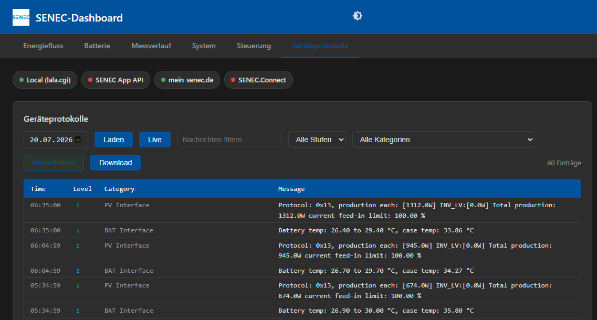

Durchsuchen der SENEC Geräteprotokolle nach Datum:
- Filterbare Tabelle (Zeit, Stufe, Kategorie, Nachricht)
- Stufenfilter: Info, Warnung, Fehler, Panik
- Kategoriefilter (automatisch aus Logeinträgen befüllt)
- Freitextsuche
- Farbkodierte Zeilenhervorhebung nach Schweregrad
- Neueste Einträge zuerst
- Live-Modus — aktualisiert automatisch das heutige Log (UTC-berücksichtigt)
- Download der rohen Logdateien

Erfordert eine konfigurierte Geräte-IP (auch wenn der lokale Konnektor nicht aktiviert ist).

## State-Referenz

Der Adapter erstellt States, organisiert nach Konnektor und Datenbereich. Alle States sind schreibgeschützt, sofern nicht explizit als Steuerungs-States gekennzeichnet.

### Verbindung & Status (`info.*`)

| State | Beschreibung |
|-------|-------------|
| `info.connection` | Gesamtverbindungsstatus (true wenn ein Konnektor aktiv) |
| `info.connectionStatus` | Detaillierter Verbindungsstatus: `all` (alle konfigurierten Konnektoren verbunden), `partial` (teilweise verbunden), `none` |
| `info.localConnected` | Lokal (lala.cgi) Verbindungsstatus |
| `info.apiConnected` | SENEC App API Verbindungsstatus |
| `info.webConnected` | mein-senec.de Verbindungsstatus |
| `info.connectConnected` | SENEC.Connect Verbindungsstatus |
| `info.lastPoll.HighPrio` | Zeitstempel der letzten hochprioritären lokalen Abfrage |
| `info.lastPoll.LowPrio` | Zeitstempel der letzten niedrigprioritären lokalen Abfrage |

### TLS States (`_local.tls.*`)

| State | Typ | Schreiben | Beschreibung |
|-------|-----|:---------:|-------------|
| `_local.tls.mode` | string | nein | Aktiver TLS-Validierungsmodus: `user`, `cached`, `tofu` oder `none` |
| `_local.tls.fingerprint` | string | nein | SHA-256-Fingerabdruck des akzeptierten Gerätezertifikats (TOFU-Modus, verschlüsselt) |
| `_local.tls.userCaPem` | string | ja | Vom Benutzer hochgeladenes CA-Zertifikat (PEM, verschlüsselt) |
| `_local.tls.cachedCaPem` | string | nein | Von mein-senec.de heruntergeladenes CA-Zertifikat (PEM, verschlüsselt) |
| `_local.tls.certFetchFailed` | boolean | ja | Auf `false` setzen um einen neuen CA-Download-Versuch auszulösen |

### Lokale States

Daten aus der lala.cgi-Abfrage werden direkt unter dem Bereichsnamen gespeichert (z.B. `ENERGY.*`, `BMS.*`, `PV1.*`, `WIZARD.*`).

**Wichtige ENERGY-States:**

| State | Typ | Beschreibung |
|-------|-----|-------------|
| `ENERGY.GUI_INVERTER_POWER` | Zahl (W) | Aktuelle PV-Erzeugung |
| `ENERGY.GUI_BAT_DATA_POWER` | Zahl (W) | Batterieleistung (positiv = Laden, negativ = Entladen) |
| `ENERGY.GUI_GRID_POW` | Zahl (W) | Netzleistung (positiv = Bezug, negativ = Einspeisung) |
| `ENERGY.GUI_HOUSE_POW` | Zahl (W) | Aktueller Hausverbrauch |
| `ENERGY.GUI_BAT_DATA_FUEL_CHARGE` | Zahl (%) | Batterie-Ladezustand |
| `ENERGY.STAT_STATE` | Zahl | Betriebszustandscode |
| `ENERGY.STAT_STATE_Text` | Text | Betriebszustand in Klartext |
| `ENERGY.STAT_HOURS_OF_OPERATION` | Zahl (h) | Betriebsstunden |

**Wichtige BMS-States:**

| State | Typ | Beschreibung |
|-------|-----|-------------|
| `BMS.MODULE_COUNT` | Zahl | Anzahl der Batteriemodule |
| `BMS.SOH.{n}` | Zahl (%) | Gesundheitszustand pro Modul |
| `BMS.CYCLES.{n}` | Zahl | Ladezyklen pro Modul |
| `BMS.CELL_VOLTAGES_MODULE_{A-D}.{n}` | Zahl (mV) | Einzelne Zellspannungen |
| `BMS.TEMP_MIN.{n}` / `BMS.TEMP_MAX.{n}` | Zahl (°C) | Modul-Temperaturbereich |
| `BMS.VOLTAGE.{n}` / `BMS.CURRENT.{n}` | Zahl (V/A) | Pack-Spannung und -Strom |

### API-States (`_api.*`)

Cloud-API-Daten werden unter `_api.Anlagen.{systemId}.*` gespeichert:

- `Dashboard.currently.*` — Echtzeit-Leistungswerte (W)
- `Measurements.Daily.*` — Stündliche Messdaten (kWh)
- `Measurements.Monthly.*` — Tägliche Messdaten (kWh)
- `Measurements.Yearly.*` — Monatliche Messdaten (kWh)
- `Measurements.AllTime.*` — Lebensdauer-Summen (kWh)
- `SystemDetails.*` — Batteriedetails, Temperaturen, Firmware
- `SystemStatus.*` — Betriebszustand, Feature-Flags

### Web-States (`_meinsenec.*`)

mein-senec.de Daten werden unter `_meinsenec.*` gespeichert:

- `Status.*` — Aktuelle Leistungswerte (kW), Betriebszustand
- `Measurements.*` — Historische Messdaten (kWh)
- `Autarky.*` — Autarkie-Prozentsätze (Tag/Woche/Monat/Jahr/Gesamt)
- `EmergencyPower.*` — Notstromreserve-Einstellungen
- `PeakShaving.*` — Peak-Shaving-Konfiguration
- `SGReady.*` — SG-Ready-Einstellungen
- `Sockets.*` — States der schaltbaren Steckdosen

### Connect-States (`_connect.*`)

SENEC.Connect Daten werden unter `_connect.Systems.{n}.*` mit Batterie- und Zähler-Unterbereichen gespeichert.

### Externe States (`_external.*`)

Daten externer Quellen werden unter `_external.{typ}.{index}.*` gespeichert:

| State | Beschreibung |
|-------|-------------|
| `_external.pv.{n}.power` | Externe PV-Leistung (W) |
| `_external.consumer.{n}.power` | Externer Verbraucher (W) |
| `_external.battery.{n}.power` | Externe Batterieleistung (W, vorzeichenbehaftet) |
| `_external.battery.{n}.soc` | Externer Batterie-Ladezustand (%) |
| `_external.battery.{n}.capacity` | Externe Batterie-Kapazität (kWh) |
| `_external.{typ}.{n}.label` | Benutzerdefinierte Bezeichnung |
| `_external.{typ}.{n}.mode` | Anzeigemodus (integrate/separate) |
| `_external.{typ}.{n}.sourceId` | Fremde State-ID oder Formel |

### Steuerungs-States (`control.*`)

Schreibbare States zur Gerätesteuerung:

| State | Typ | Beschreibung |
|-------|-----|-------------|
| `control.ForceCharge` | Boolean | Akku-Zwangsladung ein/aus |
| `control.BlockDischarge` | Boolean | Entladung blockieren ein/aus |
| `control.RebootAppliance` | Boolean | Gerät neustarten auslösen |
| `control.EmergencyPower.ReserveInPercent` | Zahl | Notstromreserve (%) |
| `control.PeakShaving.*` | Diverse | Peak-Shaving-Einstellungen |
| `control.SGReady.*` | Diverse | SG-Ready-Einstellungen |
| `control.Sockets.{n}.*` | Diverse | Pro-Steckdose Steuerung |
| `control.Wallbox.{n}.*` | Diverse | Wallbox-Steuerung |

Steuerungs-States werden nur erstellt, wenn die entsprechende Funktion aktiviert und über den konfigurierten Konnektor verfügbar ist.

## Fehlerbehebung

**Gerät reagiert nicht / häufige Neustarts**: Reduzieren Sie das hochprioritäre Abfrageintervall oder entfernen Sie benutzerdefinierte HighPrio-Datenpunkte. Das SENEC Gerät hat begrenzte Ressourcen.

**Keine Daten von API/Web**: Prüfen Sie Ihre mein-senec.de Zugangsdaten im SENEC Konto Tab. Der Adapter protokolliert Authentifizierungsfehler auf Warnungsstufe.

**Dashboard lädt nicht**: Stellen Sie sicher, dass ioBroker.web auf Port 8082 läuft. Das Dashboard wird als Web-Extension unter `/senec/` bereitgestellt.

**Fehlende States**: Die verfügbaren States hängen von Ihrem SENEC Modell, der Firmware-Version und den konfigurierten Konnektoren ab. Nicht alle States sind auf allen Systemen verfügbar.

**Steuerungs-States erscheinen nicht**: Steuerungsfunktionen müssen in den Gerätesteuerungseinstellungen explizit aktiviert werden. Jede Steuerung erfordert einen bestimmten aktiven Konnektor.

**TLS-Zertifikatsfehler bei lokaler Verbindung**: Der Adapter übernimmt die Zertifikatsvalidierung automatisch. Prüfen Sie `_local.tls.mode` um zu sehen, welche Validierungsmethode aktiv ist. Wenn TOFU-Modus aktiv ist und Sie auf CA-Validierung upgraden möchten, aktivieren Sie den mein-senec.de-Connector — der Adapter versucht das CA-Zertifikat automatisch herunterzuladen. Falls ein früherer Download fehlgeschlagen ist, setzen Sie `_local.tls.certFetchFailed` auf `false` um es erneut zu versuchen.
