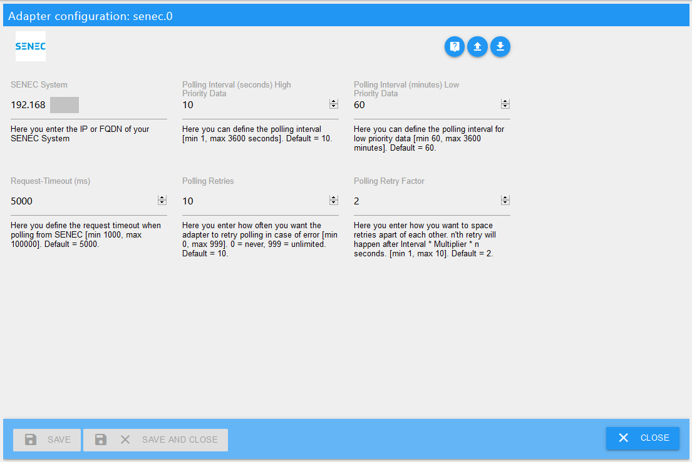

# ioBroker.senec

## senec adapter for ioBroker
Targeted at the Senec Home V2.1 System.
Other systems might work, as long as they use lala.cgi.

## Installation
You is facilitated via the ioBroker web interface and the configuration will auto-open once installation is completed.

## Setup
In addition to the adapter installation you have to add an instance of the adapter.

### Configuration 

| Feld         | Beschreibung |                                                                       
|:-------------|:-------------|
|SENEC System    |Type in the IP-address of your SENEC system (FQDN is also possible if you have a working local DNS).|
|Polling Interval|You can change the polling interval (how often the Adapter reads from your Senec System), too. (Default: 10 seconds)|
|Request-Timeout|If your network requires a higher timeout for requests sent to SENEC, please change the Request-Timeout in miliseconds accordingly. (Default: 5000 miliseconds)|
|Polling Retries|In case there is an issue communicating with SENEC the adapter will retry several times. You can adjust how often it will try to read from SENEC. (Default: 10) 
This does not apply to Adapter Start - if the System is unavailable to Adapter will stop.|
|Polling Retry Factor|To space retries apart a bit more you can adjust the Polling Retry Factor. (Default: 2) 
Example: Using default settings the 1st retry will happen 20 seconds after the initial try, the 2nd will happen 40 seconds after the 2nd try. 
After each successful connect to SENEC, the number of retries is reset.|

Once finished setting up configuration, hit `SAVE AND CLOSE` to leave configuration dialogue. The adapter will automatically restart.

## Usage
Here you can find a description of the states and how to use them. All states of this adapter are read-only states.

### States

#### Channel: info

* info.connection

    |Data type|Permission|                                                                       
    |:---:|:---:|
    |boolean|R|

   *Read-only boolean which is true if the adapter is connected to the senec system.*
   
#### Channel: BMS
   
* MODULES_CONFIGURED

    |Data type|Permission|                                                                       
    |:---:|:---:|
    |number|R|

   *Read-only number, which represents the number of modules currently configured in the system.*
   
* MODULE_COUNT

    |Data type|Permission|                                                                       
    |:---:|:---:|
    |number|R|

   *Read-only number, which represents the number of modules currently known the system (incl. non-configured).*
   

#### Channel: ENERGY
   
* GUI_BAT_DATA_FUEL_CHARGE

    |Data type|Permission|                                                                       
    |:---:|:---:|
    |number|R|

   *Read-only number, which represents the current level of your battery system in %.*
   
* GUI_BAT_DATA_POWER

    |Data type|Permission|                                                                       
    |:---:|:---:|
    |number|R|

   *Read-only number, which represents how much power is coming from / going into the battery in Watts. Negative values are discharging.*
   
* GUI_BOOSTING_INFO

    |Data type|Permission|                                                                       
    |:---:|:---:|
    |boolean|R|

   *Read-only boolean, which we don't know the exact meaning of yet.*
   
* GUI_CHARGING_INFO

    |Data type|Permission|                                                                       
    |:---:|:---:|
    |boolean|R|

   *Read-only boolean, which represents if the battery is currently charging.*
   
* GUI_GRID_POW

    |Data type|Permission|                                                                       
    |:---:|:---:|
    |number|R|

   *Read-only number, which represents the power currenty coming from / going into the grid in Watts. Negative values are sending into the grid.*
   
* GUI_HOUSE_POW

    |Data type|Permission|                                                                       
    |:---:|:---:|
    |number|R|

   *Read-only number, which represents the power in Watts currently consumed by the house.*
   
* GUI_INVERTER_POWER

    |Data type|Permission|                                                                       
    |:---:|:---:|
    |number|R|

   *Read-only number, which represents the current power supplied by your PV system.*
   
* STAT_MAINT_REQUIRED

    |Data type|Permission|                                                                       
    |:---:|:---:|
    |boolean|R|

   *Read-only boolean, which represents if your senec system requires maintenance.*
   
* STAT_STATE

    |Data type|Permission|                                                                       
    |:---:|:---:|
    |number|R|

   *Read-only number, which represents the system's state.*
   
* STAT_STATE_Text

    |Data type|Permission|                                                                       
    |:---:|:---:|
    |string|R|

   *Read-only string, which represents the system's state in human readable format (sorry - we only have the german states from senec).*
   
#### Channel: STATISTIC

* STAT_DAY_BAT_CHARGE

    |Data type|Permission|                                                                       
    |:---:|:---:|
    |number|R|

   *Read-only number, which represents the amount of power charged into the battery in kWh today.*
   
* STAT_DAY_BAT_DISCHARGE

    |Data type|Permission|                                                                       
    |:---:|:---:|
    |number|R|

   *Read-only number, which represents the amount of power drawn from the battery in kWh today.*
   
* STAT_DAY_E_GRID_EXPORT

    |Data type|Permission|                                                                       
    |:---:|:---:|
    |number|R|

   *Read-only number, which represents the amount of power in kWh delivered into the net today.*
   
* STAT_DAY_E_GRID_IMPORT

    |Data type|Permission|                                                                       
    |:---:|:---:|
    |number|R|

   *Read-only number, which represents the amount of power in kWh drawn from the net today.*
   
* STAT_DAY_E_HOUSE

    |Data type|Permission|                                                                       
    |:---:|:---:|
    |number|R|

   *Read-only number, which represents the amount of power in kWh consumed by the house today.*
   
* STAT_DAY_E_PV

    |Data type|Permission|                                                                       
    |:---:|:---:|
    |number|R|

   *Read-only number, which represents the amount of power in kWh generated by your PV today.*
   
   
#### Channel: SYS_UPDATE

* UPDATE_AVAILABLE

    |Data type|Permission|                                                                       
    |:---:|:---:|
    |boolean|R|

   *boolean-value which is true if there is an update available (Updates happen automatically and are scheduled by SENEC).*
   
   
#### Channel: WIZARD

* CONFIG_LOADED

    |Data type|Permission|                                                                       
    |:---:|:---:|
    |boolean|R|

   *boolean-value which is true if configuration is loaded. This being false is very unlikely and it shouldn't persist as false.*
   
* SETUP_NUMBER_WALLBOXES

    |Data type|Permission|                                                                       
    |:---:|:---:|
    |number|R|

   *Read-only number, which designates how many wallboxes are configured in the system.*
   
* SETUP_WALLBOX_SERIAL[0..3]

    |Data type|Permission|                                                                       
    |:---:|:---:|
    |number|R|

   *Read-only number, which designates the number of wallbox [0..3]. This is only available on systems with configured wallboxes.*