# ioBroker.senec

## SENEC Adapter for ioBroker

Monitor and control your SENEC home battery storage system. The adapter supports four independent connectors that can be used individually or combined:

- **Local** (lala.cgi) — Direct LAN polling with 10-second real-time updates. Provides full BMS data, grid meter readings, wallbox data, and appliance control.
- **SENEC App API** — Cloud-based polling via the SENEC App API. Dashboard data, measurement history, system details, and wallbox information.
- **mein-senec.de** — Web portal polling. Status overview, measurement history, autarky, emergency power, peak shaving, SG-Ready, and switchable socket control.
- **SENEC.Connect** — Azure-based API. Battery and meter data via subscription key.

Not all connectors are required. Choose based on your needs — local-only setups work fine, as do cloud-only configurations for systems without local web access.

### Supported Systems

Systems based on the lala.cgi interface should work with the Local connector. All systems with a mein-senec.de account can use the API and Web connectors. Data points may vary between system models.

* Senec Home 4.0, 6.0, 8.0, 10.0 / Blei
* Senec Home 5.0, 7.5, 10.0, 15.0 / Lithium
* Senec Home V2 5.0, 7.5, 10.0
* Senec Home V2.1
* Senec.Home V3
* Senec.Home V4
* Senec Business 30.0 / Blei
* Senec Business V2 30.0 / Blei
* Senec Business 25.0 / Lithium
* Senec Business V2_2ph / Lithium
* Senec Business V2 3ph / Lithium
* ADS Tec
* OEM LG
* Solarinvert Storage 10.0 / Blei

Systems without a local web interface can be monitored using the API and/or Web connectors only. Please contact the developer if you have any input on additional system compatibility.

## Disclaimer
**All product and company names or logos are trademarks™ or registered® trademarks of their respective holders. Use of them does not imply any affiliation with or endorsement by them or any associated subsidiaries! This personal project is maintained in spare time and has no business goal.**

## Prerequisites

- ioBroker with Node.js >= 22
- SENEC battery system on the local network (for Local connector)
- mein-senec.de account (for API and Web connectors)
- ioBroker.web adapter installed (for the built-in dashboard)

## Installation

Install the adapter from the ioBroker adapter repository. After installation, create an adapter instance and configure at least one connector.

## Configuration

The adapter settings are organized in tabs — one per connector plus general settings and debug options.

### SENEC Account

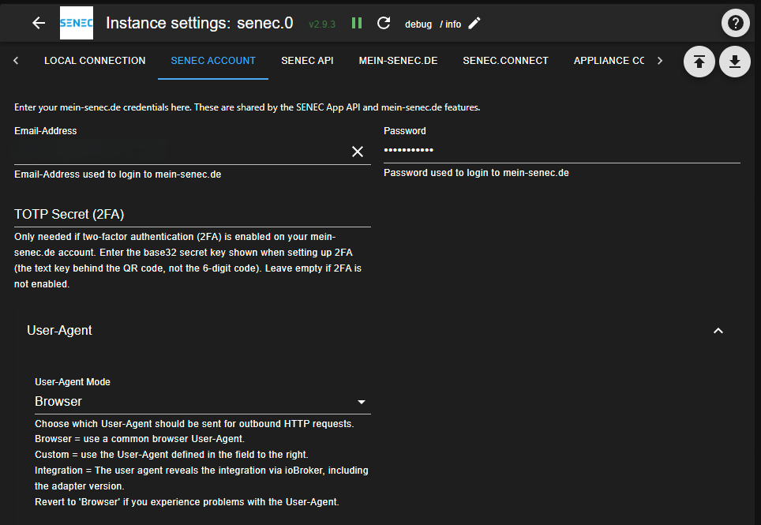

Enter your mein-senec.de credentials here. These are shared by the SENEC App API and mein-senec.de connectors. You can also configure the User-Agent mode for outbound HTTP requests.

### Local Connection (lala.cgi)

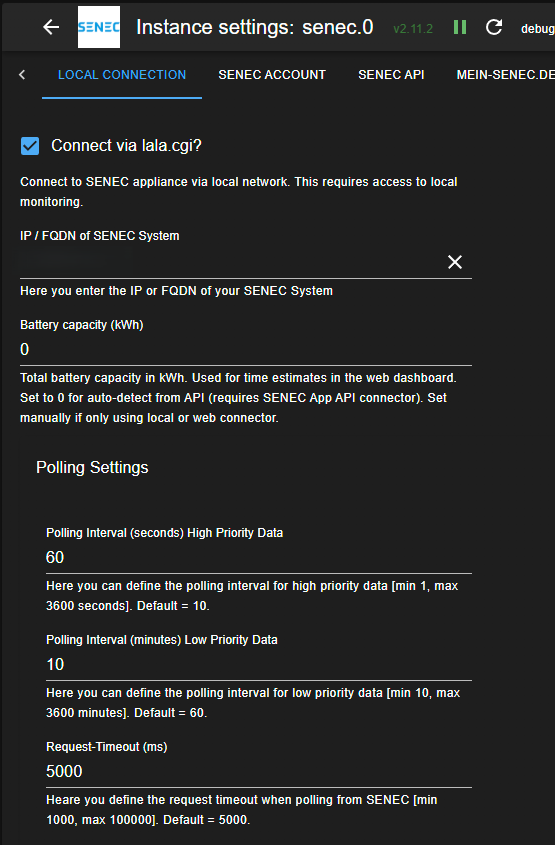

| Setting | Description | Default |
|---------|-------------|---------|
| Connect via lala.cgi | Enable local polling | On |
| SENEC System IP | IP address or FQDN of your SENEC device | — |
| Use HTTPS | Enable if your device uses HTTPS | Off |
| Polling interval (high priority) | How often to poll real-time data (seconds) | 10 |
| Polling interval (low priority) | How often to poll slow-changing data (minutes) | 60 |
| Request timeout | Timeout for HTTP requests (ms) | 5000 |
| Retries | Number of retry attempts on failure | 10 |
| Retry multiplier | Backoff factor between retries | 2 |

**Important**: Polling too frequently or requesting too many data points can overload your SENEC device. This may cause the device to restart, become unresponsive, or fail to synchronize with the SENEC cloud. If you experience issues, reduce the polling frequency or stop the adapter.

#### Additional High-Priority Polling Data Points

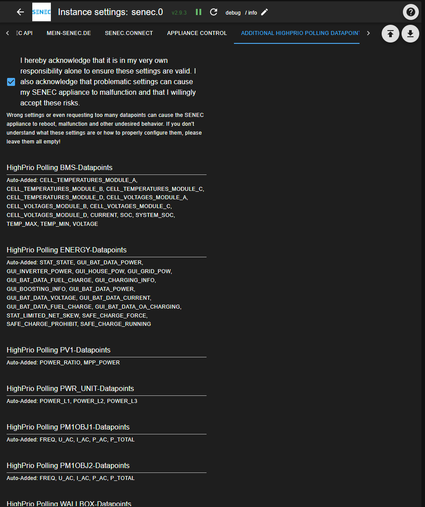

You can add additional data sections (e.g. BMS, PV1, WALLBOX) to the high-priority polling cycle. This requires accepting a disclaimer acknowledging the risks. Only characters A-Z, digits 0-9, and commas are allowed.

### SENEC App API

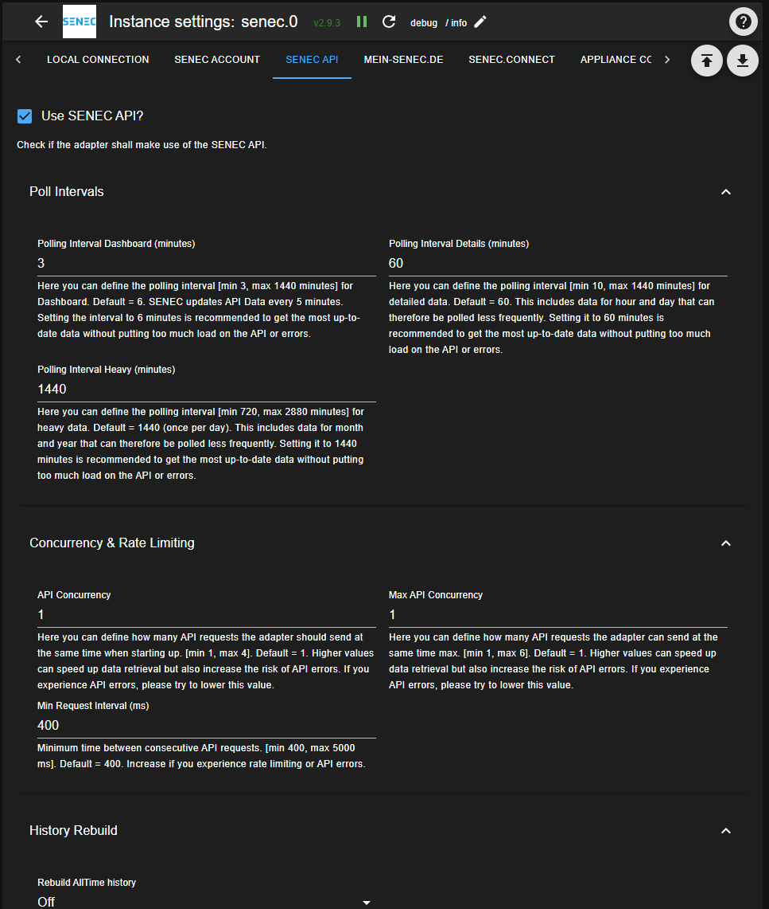

| Setting | Description | Default |
|---------|-------------|---------|
| Use SENEC App API | Enable cloud API polling | Off |
| Dashboard interval | Polling interval for dashboard/current data (minutes) | 6 |
| Details interval | Polling interval for day-level measurement data (minutes) | 60 |
| Heavy interval | Polling interval for month/year measurements (minutes) | 1440 (24h) |
| Concurrency / Max concurrency | Parallel API request limits | 1 / 1 |
| Min request interval | Minimum time between API requests (ms) | 400 |

#### History Rebuild

The API connector can rebuild historical measurement data (AllTime totals) from scratch. Configure the rebuild mode and start year if needed. This runs as a background process during the heavy polling tier.

### mein-senec.de

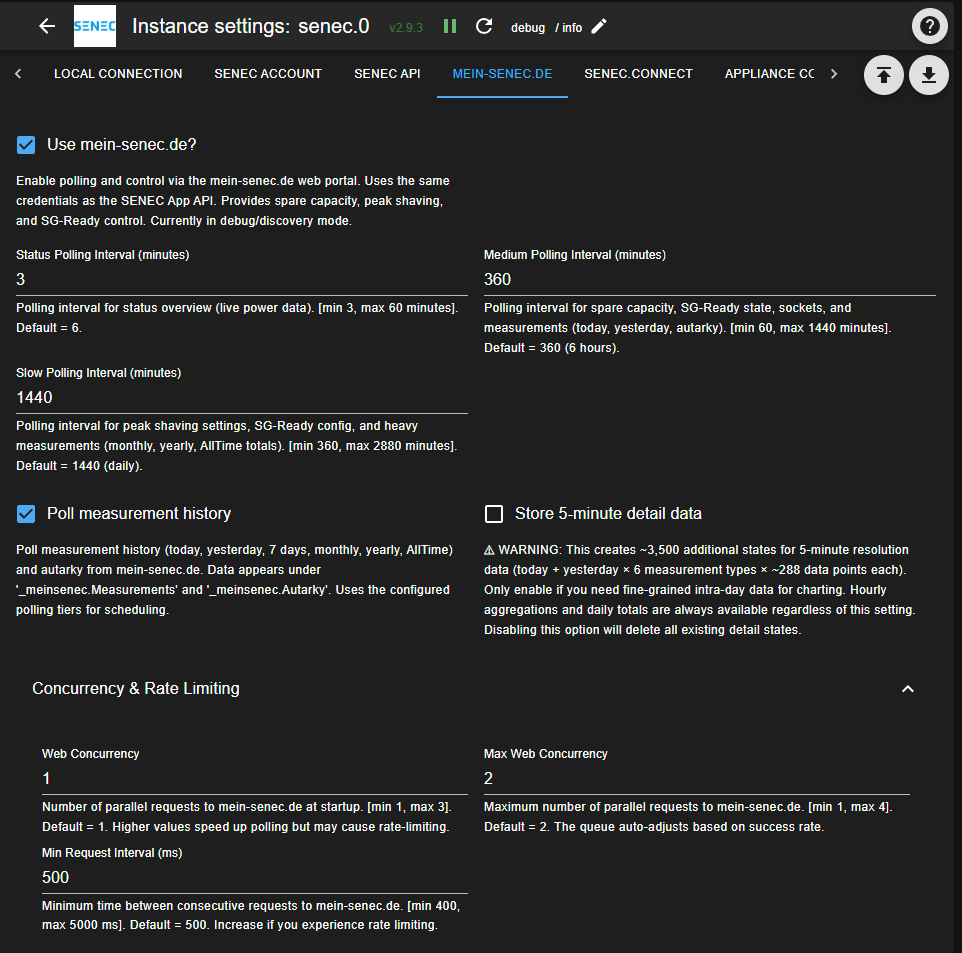

| Setting | Description | Default |
|---------|-------------|---------|
| Use mein-senec.de | Enable web portal polling | Off |
| Status interval | Polling interval for status data (minutes) | 6 |
| Medium interval | Polling interval for yesterday/autarky/spare capacity (minutes) | 360 (6h) |
| Slow interval | Polling interval for monthly/yearly/AllTime data (minutes) | 1440 (24h) |
| Poll measurement history | Enable measurement data polling | Off |
| Include 5-min detail data | Poll fine-grained detail data (~3,500 additional states) | Off |
| Concurrency / Max concurrency | Parallel request limits | 1 / 2 |
| Min request interval | Minimum time between requests (ms) | 500 |

### SENEC.Connect

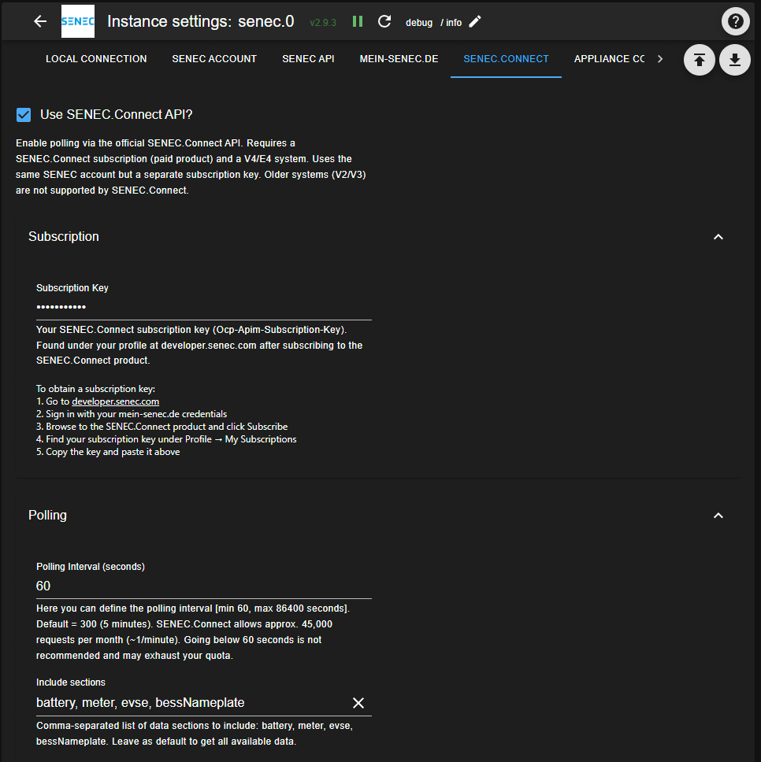

| Setting | Description | Default |
|---------|-------------|---------|
| Use SENEC.Connect | Enable Azure API polling | Off |
| Polling interval | How often to poll (seconds) | 300 |
| Subscription key | Azure API subscription key | — |
| Include sections | Which data sections to request | battery,meter |

### Appliance Control

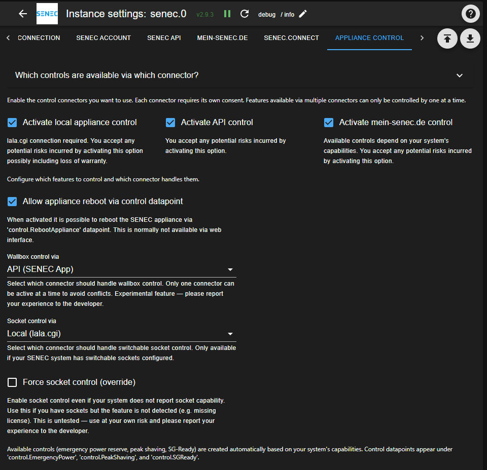

Control features allow you to change settings on your SENEC device. Each control is available via specific connectors:

| Control | Local | API | Web |
|---------|:-----:|:---:|:---:|
| Force battery charging | x | | |
| Block battery discharge | x | | |
| Appliance reboot | x | | |
| Emergency power reserve | | | x |
| Peak shaving | | | x |
| SG-Ready | | | x |
| Switchable sockets | x | | x |
| Wallbox control | x | x | |

**Use at your own risk.** Control features must be explicitly enabled in the settings with a disclaimer acknowledgment. The adapter does not protect against conflicting commands from multiple connectors.

### Debug & Logging

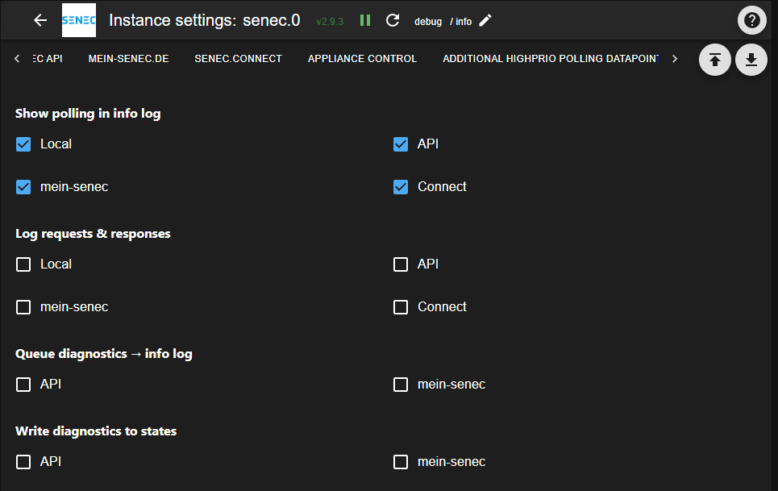

Configurable per connector (Local, API, mein-senec.de, Connect):

- **Show polling in info log** — Promotes polling status messages from debug to info level
- **Log requests & responses** — Logs HTTP details at debug level (may log sensitive data)
- **Queue diagnostics to info log** — Promotes queue statistics to info level (API + Web only)
- **Write diagnostics to states** — Writes queue data to dedicated ioBroker states (API + Web only)

## Built-in Dashboard

The adapter includes a full-featured web dashboard accessible at `http://<iobroker-ip>:8082/senec/`. It requires the ioBroker.web adapter and appears on the ioBroker.web welcome page.

Features:
- Dark and light theme (toggle in the top bar)
- Internationalization — 11 languages, follows browser locale
- Real-time updates via socket.io state subscriptions
- Data from all connectors with source indicator badges
- Keyboard accessible (tab navigation, ARIA labels)

### Overview Tab

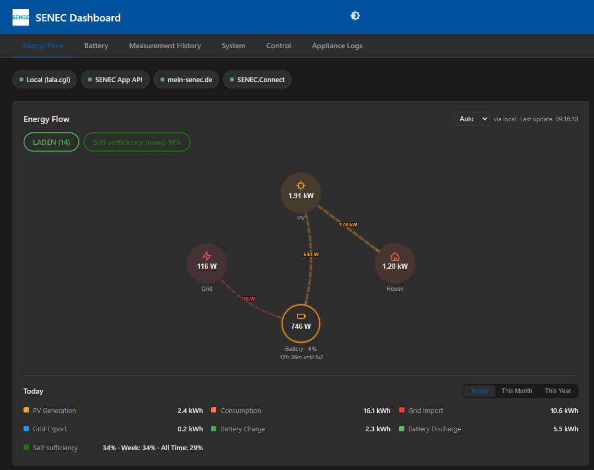

**Energy Flow Diagram** — Live SVG visualization showing power flow between PV, battery, grid, house, and wallbox. Animated curved paths with power-proportional thickness. Battery SOC gauge with fill level. Operating mode badge. Time estimates (until empty/full). Period totals (today/month/year) with autarky percentage. Data source selector (Auto/Local/API/Web).

**Live Power Curve** — Real-time line chart showing power over time for all five metrics (PV, house, grid, battery, wallbox). Smooth monotone cubic interpolation between data points. Time windows from 10 minutes to 24 hours. Toggle individual lines. Pause/disable controls. If a history adapter (InfluxDB, SQL, or History) is enabled on the power states, the chart backfills with historical data on page load.

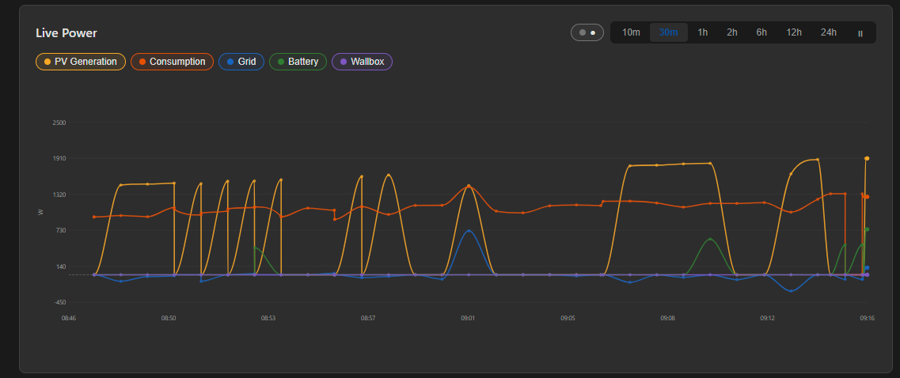

**Event Timeline** — Compact 24-hour strip showing today's warnings (orange), errors (red), and panics (purple) from the device log. Hover for full details. Auto-refreshes every 10 minutes. Requires the device IP to be configured.

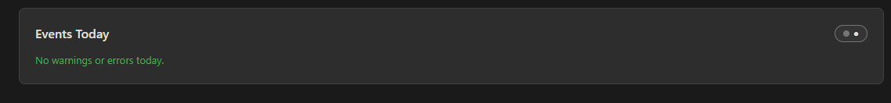

### Battery Tab

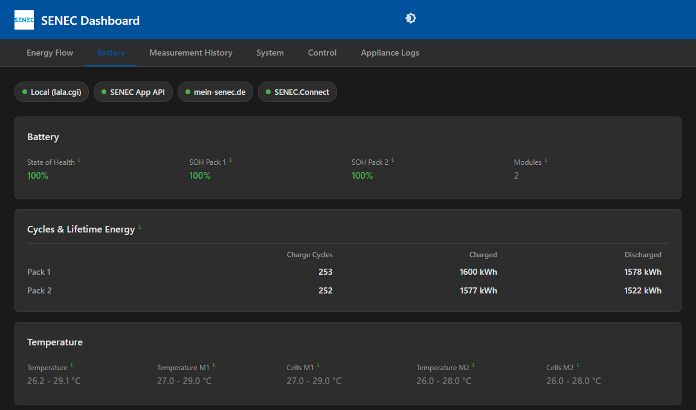

- **State of Health** — System and per-pack SOH with color-coded indicators (green > 80%, orange > 60%, red)
- **Module Status** — Active/charging/discharging module counts
- **Charge Cycles** — Per-pack cycle count and lifetime charged/discharged energy
- **Cell Voltage Heatmap** — Color-coded grid showing individual cell voltages across all modules. Red = lowest, green = highest. Per-module delta indicators. Instantly reveals cell imbalance.
- **Temperatures** — Overall, per-module, and per-cell temperatures
- **Pack Electrical** — Per-pack voltage and current

Data sourced from Local (BMS) and/or API (SystemDetails) with source badges.

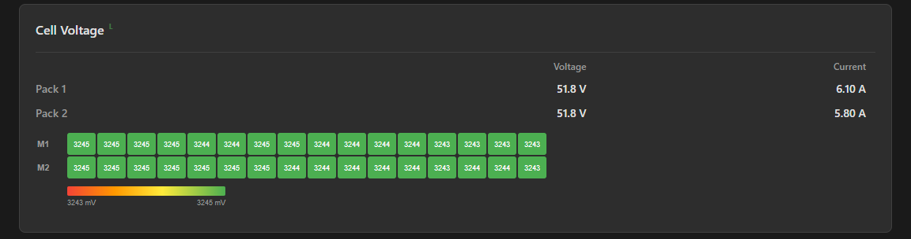

### Charts Tab

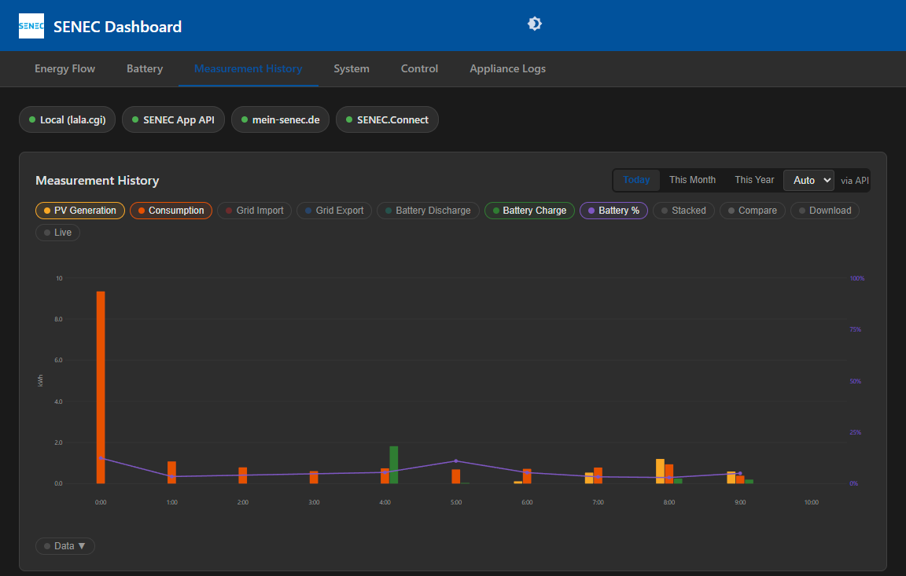

Measurement bar charts for energy data:
- **Today** — Hourly bars (auto-trims to hours with data)
- **This Month** — Daily bars
- **This Year** — Monthly bars

Features:
- Toggle individual measurement types (PV, consumption, grid import/export, battery charge/discharge)
- Stacked view (production vs. consumption)
- Comparison mode (yesterday, previous month, selectable year)
- Battery level (%) line overlay (API only)
- Data source selector (Auto/API/Web)
- Data table view
- PNG image export
- Auto-update mode

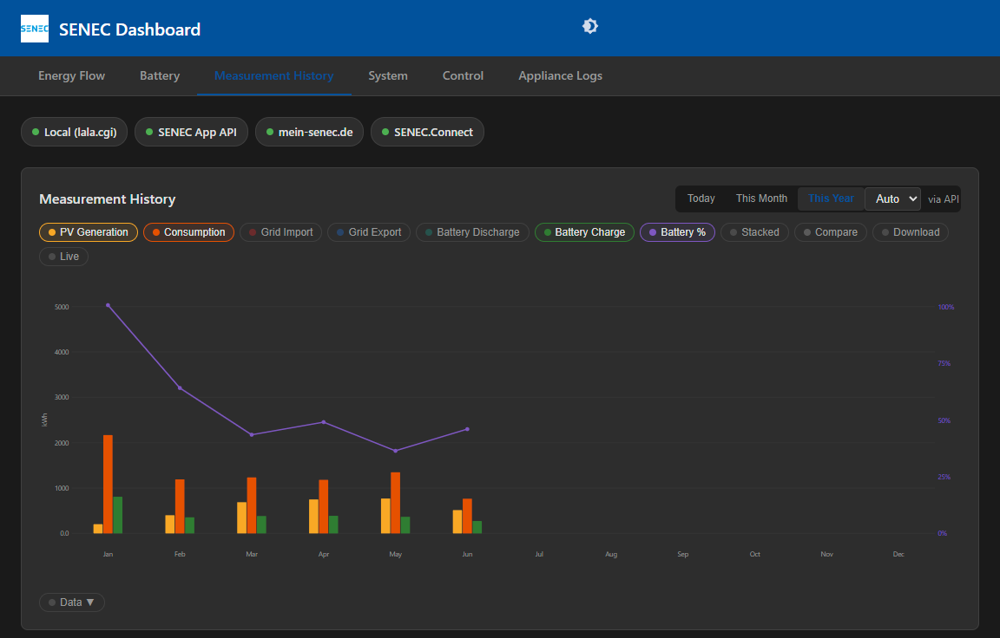

### System Tab

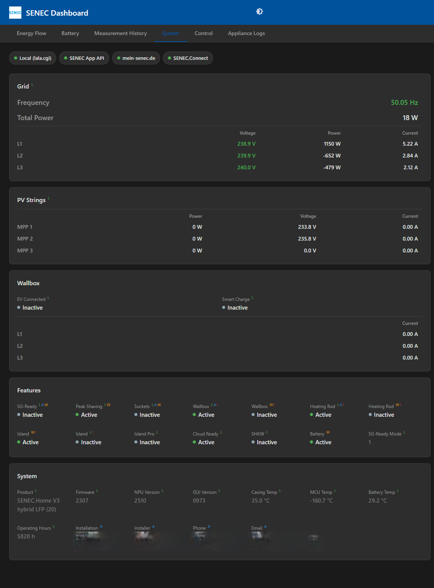

- **Grid Quality** — Frequency, total power, per-phase voltage/power/current. Supports EnFluRi 1 and EnFluRi 2 (auto-detected).
- **PV Strings** — Per-tracker MPP power, voltage, and current
- **Wallbox** — EV connected status, smart charge, per-phase charging current
- **Feature Flags** — Active features per connector with mismatch detection
- **System Details** — Product, firmware, GUI/NPU version, inverter state, temperatures (casing, MCU, battery, inverter), operating hours, installation date, installer contact

Source indicator badges show which connector provides each value.

### Control Tab

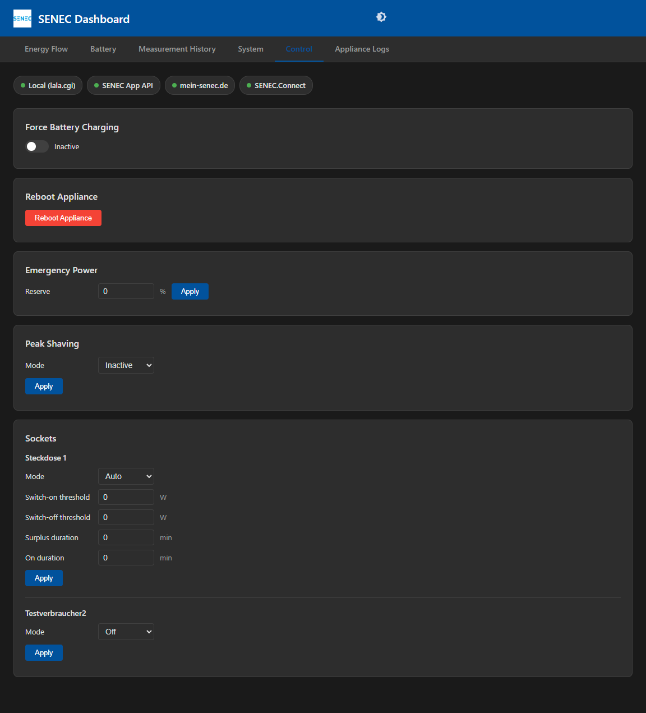

Interactive controls matching the adapter's control capabilities:
- Force battery charging (toggle)
- Appliance reboot (with confirmation dialog)
- Emergency power reserve (percentage slider)
- Peak shaving (mode-dependent fields)
- SG-Ready (enable + thresholds)
- Switchable sockets (per-socket mode, threshold settings, name editing)
- Wallbox (smart charge, current limit)

Controls check connector availability and show warnings if the required connector is not active. Apply button provides "Sent" confirmation feedback.

### Logs Tab

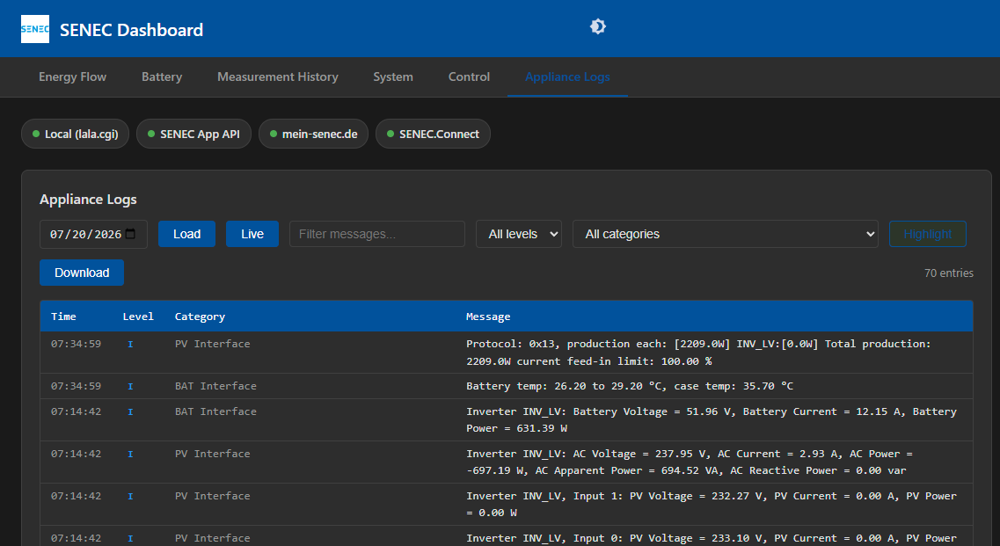

Browse SENEC device logs by date:
- Filterable table (Time, Level, Category, Message)
- Level filters: Info, Warning, Error, Panic
- Category filter (auto-populated from log entries)
- Free-text search
- Color-coded row highlighting by severity
- Newest entries first
- Live mode — auto-refreshes today's log (UTC-aware)
- Download raw log files

Requires the device IP to be configured (even if the Local connector is not enabled).

## State Reference

The adapter creates states organized by connector and data section. All states are read-only unless explicitly marked as control states.

### Connection & Status (`info.*`)

| State | Description |
|-------|-------------|
| `info.connection` | Overall connection status (true if any connector is active) |
| `info.localConnected` | Local (lala.cgi) connection status |
| `info.apiConnected` | SENEC App API connection status |
| `info.webConnected` | mein-senec.de connection status |
| `info.connectConnected` | SENEC.Connect connection status |
| `info.lastPoll.HighPrio` | Timestamp of last high-priority local poll |
| `info.lastPoll.LowPrio` | Timestamp of last low-priority local poll |

### Local States

Data from lala.cgi polling is stored directly under the section name (e.g. `ENERGY.*`, `BMS.*`, `PV1.*`, `WIZARD.*`).

**Key ENERGY states:**

| State | Type | Description |
|-------|------|-------------|
| `ENERGY.GUI_INVERTER_POWER` | number (W) | Current PV generation |
| `ENERGY.GUI_BAT_DATA_POWER` | number (W) | Battery power (positive = charging, negative = discharging) |
| `ENERGY.GUI_GRID_POW` | number (W) | Grid power (positive = importing, negative = exporting) |
| `ENERGY.GUI_HOUSE_POW` | number (W) | Current house consumption |
| `ENERGY.GUI_BAT_DATA_FUEL_CHARGE` | number (%) | Battery state of charge |
| `ENERGY.STAT_STATE` | number | System operating state code |
| `ENERGY.STAT_STATE_Text` | string | System state in human-readable text |
| `ENERGY.STAT_HOURS_OF_OPERATION` | number (h) | System uptime |

**Key BMS states:**

| State | Type | Description |
|-------|------|-------------|
| `BMS.MODULE_COUNT` | number | Number of battery modules |
| `BMS.SOH.{n}` | number (%) | State of health per module |
| `BMS.CYCLES.{n}` | number | Charge cycles per module |
| `BMS.CELL_VOLTAGES_MODULE_{A-D}.{n}` | number (mV) | Individual cell voltages |
| `BMS.TEMP_MIN.{n}` / `BMS.TEMP_MAX.{n}` | number (°C) | Module temperature range |
| `BMS.VOLTAGE.{n}` / `BMS.CURRENT.{n}` | number (V/A) | Pack voltage and current |

### API States (`_api.*`)

Cloud API data is stored under `_api.Anlagen.{systemId}.*`:

- `Dashboard.currently.*` — Real-time power values (W)
- `Measurements.Daily.*` — Hourly measurement data (kWh)
- `Measurements.Monthly.*` — Daily measurement data (kWh)
- `Measurements.Yearly.*` — Monthly measurement data (kWh)
- `Measurements.AllTime.*` — Lifetime totals (kWh)
- `SystemDetails.*` — Battery details, temperatures, firmware
- `SystemStatus.*` — Operating state, feature flags

### Web States (`_meinsenec.*`)

mein-senec.de data is stored under `_meinsenec.*`:

- `Status.*` — Current power values (kW), operating state
- `Measurements.*` — Historical measurement data (kWh)
- `Autarky.*` — Self-sufficiency percentages (day/week/month/year/all)
- `EmergencyPower.*` — Emergency power reserve settings
- `PeakShaving.*` — Peak shaving configuration
- `SGReady.*` — SG-Ready settings
- `Sockets.*` — Switchable socket states

### Connect States (`_connect.*`)

SENEC.Connect data is stored under `_connect.Systems.{n}.*` with battery and meter subsections.

### Control States (`control.*`)

Writable states for appliance control:

| State | Type | Description |
|-------|------|-------------|
| `control.ForceCharge` | boolean | Force battery charging on/off |
| `control.BlockDischarge` | boolean | Block battery discharge on/off |
| `control.RebootAppliance` | boolean | Trigger appliance reboot |
| `control.EmergencyPower.ReserveInPercent` | number | Emergency power reserve (%) |
| `control.PeakShaving.*` | various | Peak shaving settings |
| `control.SGReady.*` | various | SG-Ready settings |
| `control.Sockets.{n}.*` | various | Per-socket control |
| `control.Wallbox.{n}.*` | various | Wallbox control |

Control states are only created when the corresponding feature is enabled and available via the configured connector.

## Troubleshooting

**Device not responding / frequent restarts**: Reduce the high-priority polling interval or remove custom high-priority data points. The SENEC device has limited resources.

**No data from API/Web**: Check your mein-senec.de credentials in the SENEC Account tab. The adapter logs authentication errors at warning level.

**Dashboard not loading**: Ensure ioBroker.web is running on port 8082. The dashboard is served as a web extension at `/senec/`.

**Missing states**: Available states depend on your SENEC model, firmware version, and configured connectors. Not all states are available on all systems.

**Control states not appearing**: Control features must be explicitly enabled in the Appliance Control settings tab. Each control requires a specific connector to be active.
